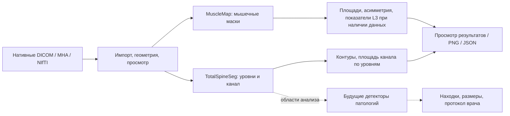

# Поясничное МРТ: воспроизводимое демо на базе SpinoSarc

Этот каталог содержит инструменты нашего форка. Оригинальные исходники,
лицензия MIT, публикация и сборочные сценарии SpinoSarc сохранены в корне
репозитория. Демо использует отдельный вход `spinosarc_app.lumbar_demo` и
официальные предобученные модели; переобучения и изменения весов нет.

## Какую часть проекта покрывает форк



| Компонент архитектуры | Что работает сейчас | Граница |
|---|---|---|
| Импорт и геометрия | Scalar 3D MHA/NIfTI; выбранные classic MR single-frame DICOM-серии; нативные наклонённые аксиальные плоскости | Произвольный набор серий и enhanced multiframe не поддерживаются |
| Анатомическая локализация | Предполагаемые L1–L2 … L5–S, маска канала TotalSpineSeg | Нумерацию проверяет врач; отдельной проверенной маски дурального мешка нет |
| Измерения канала | Площадь на покрытых нативных аксиальных срезах в мм² | Площадь не переводится в диагноз или степень стеноза по порогу |
| Мышечный анализ | Маски MuscleMap, площади, асимметрия; интенсивностная оценка FF | FF не является Dixon-измерением; PMI требует покрытия L3 и роста; диагноз саркопении не выставляется |
| Просмотр и выдача | Исходные срезы, маски, линии уровней, таблицы, PNG и JSON | Отчёт по грыжам, корешкам и конусу ещё не реализован |
| Backend/API проекта | Сохранённые структурированные результаты можно использовать как контракт интеграции | Desktop-форк пока не заменяет HTTP-сервис; подключение общих провайдеров предстоит |

Форк покрывает анатомию, измерения и просмотр. Детекторы грыж, компрессии
корешков, степени стеноза и изменений конуса — следующие отдельные компоненты.
`not_assessed` означает, что поле не оценено, а не отсутствие патологии.

## Посмотреть уже рассчитанный пример в основном проекте

Из корня основного проекта:

```sh
.venv/bin/python scripts/run_spinosarc.py --example
```

Эта совместимая точка входа вызывает инструменты форка и переиспользует
существующие окружения, MRI, веса и кеш основного проекта. Ничего переносить
или заново скачивать не требуется. Сгенерированное `SpinoSarc Demo.app` также
открывает этот режим.

Окно загружает открытый Sudirman0001 при наличии его манифеста, иначе SPIDER246.
Если для точного исходного исследования сохранён успешный запуск, контуры и
измерения восстанавливаются автоматически.

1. Просмотреть сагиттальную и аксиальную серии ползунками.
2. **Detect Levels** — выполнить TotalSpineSeg, если подходящего кеша нет.
3. **Analyze all covered levels** — посчитать канал и мышцы на покрытых уровнях.
4. Выбрать уровень: голубой контур — канал, цвета — мышечные классы; таблица
   показывает площади и асимметрию. **Analyze current axial slice** анализирует
   выбранный срез.
5. **Save annotated PNG** и **Export findings JSON** сохраняют текущие результаты.

Правая панель прокручивается: ниже списка уровней находятся таблица мышечных
измерений и кнопки экспорта. Выбор строки уровня переключает аксиальный срез.

Готовая обзорная картинка основного проекта — `artifacts/spinosarc-open-example.png`.
Она создаётся из реальных сохранённых масок, а не из нарисованной разметки.
В сохранённом примере площади канала L3–L4/L4–L5/L5–S составили
126,2/106,3/123,8 мм². Это результат конкретной модели, не эталонная разметка.
Аксиального покрытия верхних двух дисков и тела L3 нет; PMI не оценён.

## Новый независимый checkout форка

Команды ниже выполняются из корня форка. Протестированная платформа — macOS
Apple Silicon, Python 3.12. Для других платформ нужно проверить доступность
версий из lock-файлов; оригинальный `requirements.txt` не описывает этот демо-runtime.

```sh
python3.12 demo/scripts/setup_spinosarc.py --setup-tss
python3.12 demo/scripts/fetch_totalspineseg.py --workers 2 --range-workers 2
python3.12 demo/scripts/setup_spinosarc_musclemap.py
python3.12 demo/scripts/fetch_spinosarc_example.py
python3.12 demo/scripts/run_spinosarc.py --example
```

`--setup-tss` создаёт `.venv-tss`, устанавливает закреплённые пакеты и добавляет
официальный AugLab trainer в nnU-Net через `auglab.add_trainer`. Затем GUI
окружение `.venv-spinosarc` переиспользует imaging/Torch runtime через `.pth`,
а его дополнительные зависимости ставятся отдельно. Setup не скачивает веса
или исследования; за это отвечают следующие явные команды.

TSS: пакет `20260730`, веса `r20260730`, Torch `2.5.1`, nnU-Net `2.6.2`,
AugLab `20260109`, Kornia `0.8.2`. MuscleMap: исходники закреплены на
`d11df779a4e146e7e913b89cb202fc06a6e2ef6a`, abdomen v0.0, MONAI `1.3.2`.
Контрольные суммы локальных весов и конфигураций проверяются перед анализом.
Веса скачиваются с официальных GitHub Releases и Zenodo.

Модели и данные остаются локальными в игнорируемых `.venv-*`, `data/`, `var/`
и `artifacts/`. В репозитории хранятся код, lock-файлы и инструкции.

## Внешний каталог с runtime и кешем

`SPINOSARC_RUNTIME_ROOT` меняет каталог окружений, данных, весов и результатов.
Исходники и адаптеры всегда берутся из текущего checkout форка. Например,
из `vendor/spinosarc` основного проекта:

```sh
export SPINOSARC_RUNTIME_ROOT="$(cd ../.. && pwd)"
python3.12 demo/scripts/setup_spinosarc.py --verify-only
python3.12 demo/scripts/run_spinosarc.py --example
```

По умолчанию runtime находится в самом независимом checkout. Также доступны
настройки `SPINE_TSS_*`, `SPINOSARC_GUI_PYTHON`, `SPINOSARC_MUSCLEMAP_*`,
`SPINOSARC_WORK_DIR` и пути примеров. Launcher сохраняет явно заданные настройки.
`SPINOSARC_ENABLE_MUSCLES=0` отключает мышечную модель.

После переноса окружений нужно повторить setup, чтобы обновить `.pth` и
локальный `.app`. После переноса опубликованных данных выполнить
`fetch_spinosarc_example.py --verify-only`: исходные файлы проверяются, а пути
в манифесте обновляются. Кеш привязан к точным исходным файлам и геометрии;
его абсолютные пути намеренно не переносятся на другое исследование.

## Сохранение и воспроизведение результатов

Результаты каждого запуска находятся в
`var/spinosarc/analyses/<run>/`: `process-result.json`, `findings.json`,
`step1_levels/`, `step1_canal/`, а после мышечного анализа — `muscles/`.
`findings.json` содержит источник кадра, геометрию, предполагаемый уровень,
площадь, пути масок, версии моделей и статусы оценки.

Без открытия окна можно использовать уже завершённый TSS-запуск для точного
открытого примера:

```sh
.venv-spinosarc/bin/python demo/scripts/analyze_spinosarc_example.py --cpu
.venv-spinosarc/bin/python demo/scripts/render_spinosarc_example.py
```

Первая команда запускает настоящую MuscleMap на нативных аксиальных срезах;
вторая строит обзорную картинку `artifacts/spinosarc-open-example.png`.
Если matching TSS-кеша нет, сначала требуется **Detect Levels** в окне.
Путь к runtime берётся из той же переменной окружения.

## Проверки без повторного запуска больших моделей

```sh
python3.12 demo/scripts/setup_spinosarc.py --verify-only
.venv-spinosarc/bin/python demo/scripts/smoke_spinosarc.py
.venv-tss/bin/python -m pip install -r demo/requirements-test.lock
.venv-tss/bin/python -m pytest demo/tests/test_fetch_totalspineseg.py
```

Headless smoke проверяет физическую геометрию, наклонённые DICOM-плоскости,
известную площадь маски, соответствие кадров, сброс состояния и кеш.
Синтетические fixture создаются во временном каталоге; скачанные данные не
обязательны. Опциональная проверка SPIDER пропускается, если файл отсутствует.
Downloader-тесты используют маленькие синтетические архивы, без сети и весов.

Дополнительные проверки с настоящим GPU или мышечной моделью:

```sh
.venv-tss/bin/python demo/scripts/smoke_spinosarc_mps.py
.venv-spinosarc/bin/python demo/scripts/smoke_spinosarc_musclemap.py --cpu
```

Первая проверяет маленькие операции MPS без больших весов. Вторая требует
скачанный пример и официальную MuscleMap; полный TSS повторно не запускает.

## Что отличается от оригинального исполнения

На Apple Silicon TSS использует экспериментальный MPS/CPU-адаптер:
Conv3d работает на GPU; неподдержанные AvgPool3d/ConvTranspose3d выполняются
на CPU. Исходные веса, планы и размер контекста сохраняются. Режим фиксируется
в `mps-runtime.json`. Runner останавливает только собственную группу процессов
после подтверждённого завершения и проверки ожидаемых выходов, если Python
завис при cleanup; это явно отражается в `teardown_recovered`.

`SPINOSARC_DEVICE=cpu` включает отдельный экспериментальный адаптер с уменьшенным
контекстом. Он меняет предсказания и не считается эквивалентом исходного TSS;
режим записывается в `cpu-demo-runtime.json`. `SPINOSARC_DEVICE=cuda` использует
официальный TSS CLI. Отдельная диагностическая точность этих режимов не проверена.

У открытого примера общий StudyInstanceUID, но разные FrameOfReferenceUID между
сериями. Нативные координаты сохранены; регистрация не выполнена. Нумерацию,
соответствие анатомии и наложение следует визуально проверить перед трактовкой
измерений. Непокрытые уровни не подменяются ближайшим срезом.

Источники: [SpinoSarc](https://github.com/neuromath/SpinoSarc),
[TotalSpineSeg](https://github.com/neuropoly/totalspineseg),
[MuscleMap abdomen weights](https://zenodo.org/records/19631081),
[Sudirman/Mendeley V2, CC BY 4.0](https://data.mendeley.com/datasets/k57fr854j2/2).
Атрибуция данных и контрольные суммы сохраняются downloader-ом локально.
