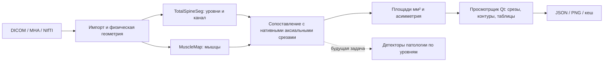

# Текущая архитектура SpinoSarc

Этот репозиторий содержит локальное приложение просмотра и измерений на МРТ.
Рабочий сценарий: исходные снимки → анатомические маски → наложение на
нативные кадры → площади и асимметрия → просмотр, PNG и JSON.
Запуск — в [demo/README.md](../demo/README.md), порядок разработки —
в [workspace_ru.md](workspace_ru.md).

## Части кода

| Компонент | Реализация | Что делает |
|---|---|---|
| Вход и геометрия | `spinosarc_app/demo_io.py` | MHA/NIfTI и classic single-frame MR DICOM; исходные SOP/IPP/IOP, наклонённые нативные плоскости |
| Запуск анатомической модели | `spinosarc_app/totalspineseg/runner.py` | Локальные веса TSS, отдельный процесс, остановка собственных workers, проверка выходов |
| Уровни и покрытие | `spinosarc_app/totalspineseg/level_mapper.py` | RAS/LPS, сопоставление уровня с аксиальной плоскостью и проверки покрытия |
| Канал и площадь по уровням | `spinosarc_app/totalspineseg/canal_csa.py`, `multi_level_analyzer.py` | Перенос маски на нативную сетку; количество пикселей × их физическая площадь |
| Мышцы | `spinosarc_app/inference_engine.py`, `analyzer.py` | Официальная MuscleMap, маски восьми мышечных классов, площади и асимметрия |
| Сценарий приложения | `spinosarc_app/lumbar_demo.py` | Qt-работники, выбор исследования/среза, кеш, статусы, таблицы, PNG/JSON; прокручиваемая панель |
| Базовый просмотрщик | `spinosarc_app/gui.py` | Виджеты SpinoSarc и отображение изображения с физическим соотношением сторон |
| Подготовка и проверки | `demo/scripts/`, `demo/tests/` | Закреплённые окружения, официальные модели, открытые данные, геометрические проверки |

Нейросети предсказывают анатомические маски. Геометрия, площади и статусы
рассчитываются явно в коде. Площадь канала не превращается порогом в степень
стеноза. Маска канала не подтверждена как отдельная маска дурального мешка.
Интенсивностная FF использует Otsu и не является количественной Dixon-оценкой.

## Что уже проверено и что предстоит

На открытом Sudirman 0001 проверены импорт настоящих DICOM, TSS на MPS,
сопоставление уровней, наложение контура канала и мышц, площади, сохранение и
восстановление результата. Анализ покрывает три нижних дисковых уровня;
два верхних и тело L3 остаются неоценёнными из-за отсутствия покрытия.
Нумерация требует подтверждения, совмещение — проверки: у серий разные
FrameOfReferenceUID. Это проверка исполнения, а не диагностической точности.

Грыжи/протрузии и их размеры, компрессия корешков, степени стеноза, патология
конуса и полный протокол врача — будущие задачи. Их планы и обзоры находятся
в [research/](../research/README.md). Официальные модели в этом форке
не переобучались; источники и изменения перечислены в [FORK.md](../FORK.md).

## Граница репозитория

FastAPI-приложения исходного lumbar MRI проекта в этом checkout нет.
SpinoSarc не вызывает тот backend; упоминания API и подготовленных SPIDER ROI
в исследовательских снимках относятся к исходному проекту. Здесь развиваются
desktop-код, геометрия, провайдеры моделей и измерения. Интеграция с сервером
может быть отдельным следующим этапом.

Код отделён от runtime: выбор среды и каталогов делает
`demo/scripts/_demo_paths.py`. Локальный JSON или переменная окружения могут
переиспользовать установленные зависимости и веса, а приложение и адаптеры
TSS по умолчанию берутся из текущего checkout; явные настройки провайдера
сохраняются. Большие данные, модели и результаты
не входят в Git; источники открытых наборов — в
[research/datasets/README.md](../research/datasets/README.md).
