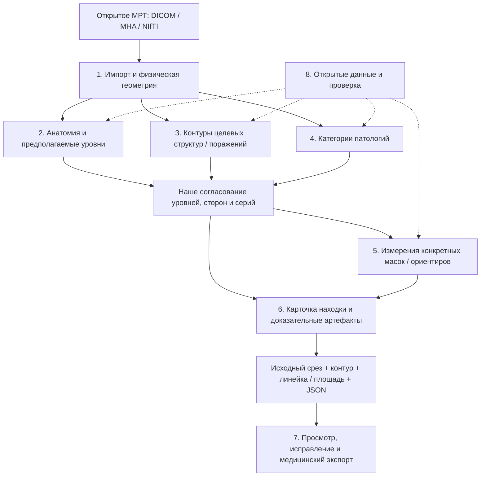

# Компоненты поясничного МРТ: что переиспользовать и с чего начать

> Исследовательский снимок на 8 октября 2026 года. Источник: `med diploma/docs/lumbar_mri_component_map_ru.md`.
> Это перенесённый контекст исходного проекта, а не действующая спецификация standalone-форка SpinoSarc.
> Упомянутые реализованные backend/API, модели-классификаторы, SPIDER ROI, локальные команды и результаты относятся к исходному проекту `med diploma` и сюда не перенесены.
> Названия «наш проект», «реализовано» и «следующий этап» ниже читаются в этом историческом контексте. Исследовательские предложения не означают подключённых или проверенных диагностических компонентов.
> Действующая [инструкция демо](../../demo/README.md); [индекс исследований и текущее состояние](../README.md). Источники и даты исходного исследования сохранены; новой проверки источников при переносе не проводилось.

Дата: 7 октября 2026 года. Решение для нашего backend-демо: новое МРТ → находки по уровням → исходные срезы с подписанными контурами → измерения. Основа оценки — [исследование моделей](../tools/lumbar_mri_reuse_research_ru.md), [измерителей](../tools/lumbar_mri_measurement_tools_ru.md) и [визуальных находок](../tools/lumbar_mri_visual_findings_reuse_ru.md).

**Стартовый набор: наш импорт/API + TotalSpineSeg + перенос контуров из SpinoSarc + SimpleITK + выбранные измерения SpineReport + PNG/JSON. Затем проверить SCT для отдельного мешка и RSNA для категорий стеноза.** SpineNet остаётся вариантом для более широких дисковых признаков при подходящих условиях. Готового подтверждённого контура самой поясничной грыжи в shortlist нет.

Приоритет здесь означает пригодность для интеграции в наш проект, а не доказанное превосходство модели по точности. Новые модели в нашем окружении не запускались. Один проект может участвовать в нескольких типах компонентов; это не означает, что нужно установить все перечисленные альтернативы.

Статусы: **старт** — использовать существующую основу либо адаптировать небольшой проверенный модуль; **следующий PoC** — воспроизвести отдельную модель/метод; **резерв** — только при установленной необходимости; **позже** — после работающего backend; **не закрыто** — подходящий готовый компонент не подтверждён.

## Схема типов компонентов

Типы 2–4 работают параллельно: локализатор, сегментатор и классификатор могут иметь разные требования к сериям и собственную подготовку изображения. Их результаты нужно согласовать; передача TSS crop в чужой классификатор без проверки не является готовой интеграцией. Типы 3–4 не подменяют друг друга: категория грыжи не задаёт контур выпячивания.

## 1. Импорт, выбор серий и геометрия

| Компонент | Что берём | Ограничение | Выбор |
|---|---|---|---|
| Наш `imaging.py` и API | DICOM/ZIP/MHA/NIfTI, геометрия, задания, ссылки на исходные изображения | Classic single-frame DICOM; multi-series согласование расширить | **Старт: сохранить** |
| [SimpleITK](https://github.com/SimpleITK/SimpleITK) | Физические преобразования, ресэмплинг масок и работа с volumes | Проверять исходное разрешение, покрытие и интерполяцию | **Старт: уже зависимость** |
| [SpinoSarc](https://github.com/neuromath/SpinoSarc) | Отдельные приёмы сопоставления sagittal/axial и работу с исходной плоскостью | Не переносить весь импорт/GUI; level mapping по world-z требует своей проверки | **Старт: выбранные функции** |

Главный полезный модуль SpinoSarc — [resample_canal_to_axial_slice](https://github.com/neuromath/SpinoSarc/blob/63b7405d1276740dfde75e00d1e7ad58da6c10fd/spinosarc_app/totalspineseg/canal_csa.py): DICOM IPP/IOP, отдельные row/column spacing, affine и LPS/RAS. Реальный многослойный путь использует эту функцию. Одинаковые номера срезов разных серий не означают одинаковую анатомическую плоскость; движение и несовместимость координат также проверять.

## 2. Анатомия и предполагаемые уровни

| Компонент | Результат | Почему подходит / ограничение | Выбор |
|---|---|---|---|
| [TotalSpineSeg](https://github.com/neuropoly/totalspineseg) | Маски анатомии и предполагаемые уровни | Уже реализован provider; отдельную грыжу не выделяет | **Основной старт** |
| [SPINEPS](https://github.com/Hendrik-code/spineps) | Анатомические подструктуры, instance segmentation, VERIDAH-нумерация | Вторая анатомическая система; использовать для конкретных провалов TSS | **Резерв** |
| [SpineSegDiff](https://gitlab.ethz.ch/BMDSlab/publications/low-back/diffusion-models-for-lumbar-spine-mri-segmentation) | Сагиттальные тела/диски/канал; опубликован [checkpoint](https://github.com/BMDS-ETH/SpineSegDiff/releases/tag/v1.0.0) | Не добавляет готовую патологическую маску грыжи | **Резерв** |

Сохранить существующий TSS subprocess и model manifest. Нумерация остаётся предполагаемой при неполном поле/переходной анатомии. Наличие маски не подтверждает диагноз.

## 3. Контуры целевых структур и поражений

| Компонент | Что обводит | Чего не даёт | Выбор |
|---|---|---|---|
| [SCT / model-canal-seg](https://github.com/ivadomed/model-canal-seg) | Бинарную 3D-структуру, которую авторы определяют как дуральный мешок | Нет номеров дисков, степени стеноза и маски грыжи; поясничное качество не проверено | **Следующий PoC мешка** |
| TSS-маска канала | Анатомическую структуру из текущего сегментатора | Не подтверждён отдельный клинический контур мешка | **Старт: показывать как канал** |
| [Nixon AP tool](https://huggingface.co/akashnixon123/apdiameter007) | 2D-маску для AP на выбранном midsagittal T2 DICOM | Не 3D-площадь мешка; исправления геометрии и неизвестная лицензия | **Резерв для 2D AP** |
| Отдельная поясничная грыжа | Выпячивающийся материал | Готовый воспроизводимый публичный комплект пока не подтверждён | **Не закрыто** |

У SCT есть [веса r20260406](https://github.com/ivadomed/model-canal-seg/releases/tag/r20260406) и [документированный inference/QC](https://spinalcordtoolbox.com/latest/user_section/command-line/deepseg/canal.html). Это первый кандидат для проверки маски мешка. Фиксировать совместимую версию SCT и условия checkpoint; открытое происхождение всех обучающих данных не подтверждено.

`affected_disc`, `canal`, `dural_sac`, `herniated_material` — разные типы контуров. ROI и карта внимания хранятся отдельно. Размер целого диска не является размером грыжи.

## 4. Категории патологий по уровням и сторонам

| Компонент | Что обнаруживает | Главные ограничения | Выбор |
|---|---|---|---|
| [RSNA 2024: третье место](https://github.com/Moyasii/Kaggle-2024-RSNA-Pub), [веса](https://www.kaggle.com/datasets/akinosora/rsna2024-lsdc-3rd-models-pub) | Центральный, левый/правый фораминальный и субартикулярный стеноз, пять уровней | Требования серий; тяжёлый ансамбль; права весов отдельно не подтверждены | **Первый диагностический PoC стеноза, условно** |
| [SpineNet V2](https://github.com/rwindsor1/SpineNet) | Бинарная грыжа, дегенерация и другие дисковые признаки, центральный/фораминальный стеноз | Некоммерческие ограничения, закрытое обучение, свой preprocessing; без маски/размеров грыжи | **Условный вариант для широких признаков** |
| [Heng: часть седьмого места RSNA](https://github.com/hengck23/solution-rsna-2024-lumbar-spine) | Отдельные ветви центрального/фораминального стеноза | В NFN есть ошибочные веса с перестановкой сторон; авторы выделяют исправленные folds | **Резерв** |
| [OLSIA](https://github.com/imedslab/spineslicer) | Pfirrmann 2–5 в опубликованном пути | Не все классы; лицензия и закрытое происхождение обучения | **Резерв дисковой дегенерации** |
| [NUHS/NUS SpineAI](https://github.com/NUHS-NUS-SpineAI/SpineAI-Detect-Classify-LumbarMRI-Stenosis) | ROI и оценки стеноза | Старое TF-окружение, готовый публичный bundle не подтверждён | **Не стартовать сейчас** |

RSNA подходит по целевой задаче и публичному корпусу, а не доказанно превосходит альтернативы на наших снимках. Сначала отдельная исполнимая ветвь; её качество не равно качеству полного ансамбля. В исходной шкале `normal/mild` — объединённый класс. SpineNet оценивать по [условиям кода/весов/результатов](https://github.com/rwindsor1/SpineNet/blob/main/LICENCE.md).

Пороговый флаг SpinoSarc — отдельный тип результата: «измерение пересекло заданный порог». Его не переименовывать в степень из RSNA или полноценный диагноз.

## 5. Измерения и морфометрия

| Компонент | Что получаем | Что адаптировать | Выбор |
|---|---|---|---|
| [SimpleITK](https://simpleitk.org/doxygen/latest/html/classitk_1_1simple_1_1LabelShapeStatisticsImageFilter.html) | Физическую геометрию, площади/объёмы, характеристики формы | Определения клинических ориентиров; bbox/Feret не переименовывать в размеры грыжи | **Основной старт** |
| [SpinoSarc canal_csa](https://github.com/neuromath/SpinoSarc/blob/63b7405d1276740dfde75e00d1e7ad58da6c10fd/spinosarc_app/totalspineseg/canal_csa.py) | Контур на исходной axial-плоскости и площадь в мм² | Проверка входной маски/серий, ошибки и требования покрытия | **Основной старт: небольшой модуль** |
| [SpineReport measure_seg](https://github.com/ivadomed/SpineReport/blob/main/spinereport/utils/measure_seg.py) | AP/RL, площади, медианную толщину/объём дисков, показатели отверстий | Iso-преобразования, составные SC+CSF inputs, определения показателей | **Старт: выбранные функции** |
| [OLSIA / SpineSlicer](https://github.com/imedslab/spineslicer) | Безразмерный DHI | Отделить Slicer, подтвердить права; не три абсолютные высоты | **Резерв** |
| [Nixon](https://huggingface.co/akashnixon123/apdiameter007) | AP в мм и линию на выбранном сагиттальном срезе | Исправить PixelSpacing, физическую длину и нумерацию; права | **Резерв** |
| [Sudirman / Natalia, MATLAB](https://data.mendeley.com/datasets/zwd3hgr6gg/1) | Контурные ориентиры и расстояния авторского метода | Требует подходящих многоклассовых масок и переноса в Python | **Резерв** |

Первое измерение — площадь конкретной маски в указанной плоскости. Затем AP по явным endpoints и определённая толщина диска. SCT не является автоматической заменой составных меток SpineReport: для SCT-измерений отдельно проверять входной контракт. Три радиологические высоты, размеры грыжи и миграция требуют своих определений/ориентиров.

## 6. Находки, изображения с аннотациями и экспорт

| Компонент | Что берём | Ограничение | Выбор |
|---|---|---|---|
| Наш FastAPI + artifacts | Задания, результаты, происхождение и скачивание артефактов | Добавить типы PNG/JSON/масок, source frame/plane и статусы полей | **Основной старт** |
| Наш renderer + SimpleITK | Исходное изображение с подписанным контуром, линейкой и значением | Сейчас есть анатомические sagittal previews; расширить и подключить к API | **Основной старт** |
| SpineReport / SpinoSarc reports | Примеры CSV, PNG и оформления отчётов | Не переносить весь GUI/PDF до готового контрактного результата | **Выбранные части** |
| [highdicom](https://github.com/ImagingDataCommons/highdicom) | DICOM SEG и SR с пространственными ROI/ссылками на снимки | Требует корректных исходных DICOM и метаданных | **Позже** |

Общий контракт собственного backend: тип проблемы, предполагаемый уровень/сторона, статус нумерации, detector/version, серия/срез/плоскость, тип контура, метод/единица/линия измерения, PNG/маска/JSON. Источник каждого поля сохраняется. Недоступный метод возвращает `not_assessed`, а не норму.

## 7. Просмотр и исправление

| Компонент | Зачем | Выбор |
|---|---|---|
| [3D Slicer](https://github.com/Slicer/Slicer) | Проверять маски и линейки, исправлять контуры | **Проверочный инструмент**, не backend-зависимость |
| [Cornerstone3D](https://github.com/cornerstonejs/cornerstone3D) | Собственный веб-интерфейс с масками/измерениями | **Позже**, если нужен свой UX |
| [OHIF](https://github.com/OHIF/Viewers) | Готовый медицинский web viewer | **Позже**, при DICOM/PACS-сценарии |
| [MONAI Label](https://github.com/Project-MONAI/MONAILabel) | AI-assisted исправление/сбор разметки | **Позже**, при доступном ресурсе аннотирования |
| [SpinoSarc GUI](https://github.com/neuromath/SpinoSarc) | Сравнить пользовательский путь и показать узкое desktop-демо | **Референс / необязательный PoC**, не обязательная основа FastAPI |

Для нашего текущего scope достаточно PNG + JSON + masks. Viewer не является детектором и не создаёт автоматический контур грыжи.

## 8. Данные и проверка

| Источник / компонент | Для чего переиспользовать | Ограничение | Выбор |
|---|---|---|---|
| [SPIDER](https://spider.grand-challenge.org/data/) | Открытые MRI, reference-маски, доступные дисковые метки; технический PoC | Нет достоверной L1–S1 нумерации; TSS обучался на SPIDER, это не независимый тест его анатомии | **Старт: уже подготовлен корпус** |
| [RSNA 2024](https://registry.opendata.aws/rsna-lumbar-spine-degenerative-classification-dataset/) | Несколько серий, координаты и категории стеноза | Некоммерческие условия/ограничение распространения; нет готовых контуров грыжи | **Следующий PoC multi-series** |
| Наши geometry/source checks | Проверка направления, расстояний, mask-image grid, происхождения | Технические проверки не доказывают клиническую точность | **Старт: сохранить и расширять по изменению** |

Новые пациенты и новая экспертная разметка не являются условием старта. Reference-маски/CSV открытого набора показывать как эталон, а не выдавать за inference на новом снимке.

## Что не ставим в начало

| Кандидат | Причина |
|---|---|
| [LDH-DL-MODEL](https://github.com/ElzatElham/LDH-DL-MODEL) | Не подтверждены обученные lumbar checkpoints и полный измерительный inference |
| [mutil-task](https://github.com/ViolentLittleHead/mutil-task) | Отсутствующий checkpoint/import; маска диска вместо патологического материала |
| [CervAI-X](https://github.com/zhibaishouheilab/CervAI-X) | Шейная задача, фиксированные уровни/допущения и ограничения использования |
| [MRI-GPT](https://github.com/NeoNogin/MRI-GPT) / [MRI-pathology](https://github.com/Trmy210/MRI-pathology) | VLM severity / Grad-CAM не дают подтверждённый измеряемый контур грыжи |
| [U-ResNet](https://www.nature.com/articles/s41598-026-42870-9) / [Freiburg DSCSA](https://pmc.ncbi.nlm.nih.gov/articles/PMC10525778/) | В проверенных источниках не подтверждён готовый публичный комплект подходящих весов/inference |
| BianqueNet, LSMA-PQR, SpineScan, LumbarSeg | Недостаточно подтверждённые артефакты/условия либо более узкая задача без преимущества для текущего старта; детали в обзорах |

Это оценки проверенных публикаций/репозиториев, не утверждение, что решение отсутствует у авторов.

## Рекомендуемый порядок интеграции

| Очередь | Набор | Конкретный результат | Условие перехода |
|---|---|---|---|
| **1. Анатомическая измерительная карточка** | Наш API + TSS + SpinoSarc geometry + SimpleITK | Исходный срез, контур канала/диска, измерение с методом/единицей и PNG/JSON | Реальный inference, правильная физическая привязка, провайдеры и ошибки отражены в результате |
| **2. Морфометрия и отдельный мешок** | Выбранные SpineReport функции; отдельный SCT PoC | Определённые дисковые показатели; при подходящей маске — `dural_sac` AP/площадь | Согласованные методы/геометрия; пригодная маска, совместимые версии и условия |
| **3. Диагностические категории** | Минимальный подходящий RSNA provider; SpineNet как условный вариант | Поддержанные патологические поля по уровням/сторонам, связанные со снимками | Исполнимость, права весов и подходящие серии; проверка отдельно от полного ансамбля |
| **4. Собственно грыжа и подробные размеры** | Подтверждённый патологический сегментатор/ориентиры или узкая разработка | Контур выпячивания, явно определённые размеры и миграция | Истинная патологическая маска/ориентиры и проверка метода |
| **5. Viewer и обмен** | highdicom + OHIF/Cornerstone/Slicer | Просмотр/правка и медицинский экспорт | Стабильный backend-результат и корректная DICOM-привязка |

В очередь 1 не включается обещание автоматического диагноза: это проверенный визуальный измерительный слой. Степень стеноза появляется в очереди 3. Грыжевые размеры не скрываются под измерением всего диска.

## Условия и текущая готовность

| Компонент | Код | Веса / происхождение / локальная готовность |
|---|---|---|
| Наш API, SimpleITK | Существующая основа; SimpleITK Apache-2.0 | API готов, SimpleITK установлен; клиническое качество не заявлено |
| TotalSpineSeg | LGPL-3.0, существующий адаптер | Зафиксирован релиз; факт полного скачивания/реального запуска проверять отдельно |
| SpinoSarc выбранные функции | MIT | Сохранять атрибуцию; внешние модели/GUI имеют свои условия. CLI выглядит устаревшим; использовать проверенный GUI-free модуль, не запускать CLI вслепую |
| SpineReport | LGPL-3.0 | Измерительный код без новой патологической модели; окружение/входной контракт ещё не воспроизведены |
| SCT model-canal-seg | MIT репозитория модели | Веса опубликованы; их отдельные условия и полностью открытое обучение не подтверждены; локально не запускался |
| RSNA third place | MIT кода | Bundle опубликован; права весов отдельно не подтверждены; полный ансамбль тяжёлый; локально не запускался |
| SpineNet | Некоммерческие ограничения | Ограничения распространяются на код/веса/результаты; обучение не целиком открыто; локально не запускался |
| Nixon / OLSIA | Лицензия не подтверждена | Опубликованные веса с не полностью открытым обучением; локально не запускались |

Права кода, конкретного checkpoint и данных фиксируются отдельно. «Демо на открытых снимках» достижимо; «все модели обучены исключительно на открытых изображениях» у полного рекомендуемого набора не подтверждено. Это ограничение остаётся видимым при выборе провайдеров.
