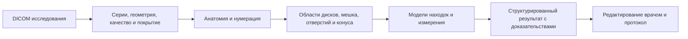

# План разработки модуля МРТ пояснично-крестцового отдела

> Исследовательский снимок на 8 октября 2026 года. Источник: `med diploma/docs/lumbar_mri_module_plan_ru.md`.
> Это перенесённый контекст исходного проекта, а не действующая спецификация standalone-форка SpinoSarc.
> Упомянутые реализованные backend/API, модели-классификаторы, SPIDER ROI, локальные команды и результаты относятся к исходному проекту `med diploma` и сюда не перенесены.
> Названия «наш проект», «реализовано» и «следующий этап» ниже читаются в этом историческом контексте. Исследовательские предложения не означают подключённых или проверенных диагностических компонентов.
> Действующая [инструкция демо](../../demo/README.md); [индекс исследований и текущее состояние](../README.md). Источники и даты исходного исследования сохранены; новой проверки источников при переносе не проводилось.

Дата проверки источников: 6 октября 2026 года.

Дополнение от 7 октября: [обзор готовых моделей и весов](../tools/lumbar_mri_reuse_research_ru.md).
Следующий диагностический этап начинается с проверки повторного использования
SpineNet/RSNA и измерений SpineReport; собственное обучение становится
резервом для конкретных незакрытых задач. Ни одна из новых диагностических
моделей пока не подключена к API.

Основа требований — предоставленный пользователем экспертный протокол. Уточнённая текущая задача: **сделать демонстрацию на открытых данных, чтобы получить разрешение на работу с реальными пациентами**. До этой демонстрации нет доступа к клиническим данным и ресурса на новую экспертную разметку. Клиническая валидация и аккредитация — последующие этапы. Конкретный маршрут допуска пока не выбран.

Конкретные компоненты, структуры данных, API и пример расчёта описаны в [технической реализации](../archive/parent_project/lumbar_mri_implementation_ru.md).

Текущая реализация от 7 октября 2026 ограничена бэкендом: импорт снимков,
адаптер TotalSpineSeg, области отдельных дисков и исследовательские измерения.
Диагностические поля пока имеют статус `not_assessed`. Возможности и запуск —
в [README](../README.md); ближайшие этапы описаны в [плане бэкенда](lumbar_level_mvp_plan_ru.md).
Просмотрщик и полный протокол из этого документа остаются последующими этапами.

## Рекомендуемое решение

Строить модуль, который извлекает **структурированные визуализационные находки**, показывает их на исходных снимках и заполняет черновик протокола. Связь «уровень → сторона → зона → изменение → нервная структура → воздействие» должна быть основной единицей результата.

Разработку на открытых данных начать можно. Для текущего этапа брать готовые изображения, маски и метки, вычислять доступные измерения и показывать полный процесс работы с протоколом. Новая врачебная разметка не является условием старта. Реестр источников ниже уже даёт исходную основу; до демонстрации достаточно технически проверить выбранные примеры и условия используемых артефактов, без двухнедельного исследования всего корпуса.

Первая демонстрация: анатомическая разметка, измерения, показ доступных дисковых/стенотических находок и редактируемый протокол. У каждого поля хранить происхождение: вычислено алгоритмом, взято из готовой разметки открытого набора, введено вручную или пока не оценено. Поля для конуса, корешков и остальных разделов закладываются сразу. Это позволит показать желаемую подробность без подмены готовой разметки автоматической диагностикой.

## Интерпретируемость: гибрид моделей, измерений и правил

Рекомендуемая архитектура — **гибрид с проверяемыми промежуточными результатами**. Модели распознают анатомию и отдельные признаки, формулы считают измерения, явные правила проверяют поддержанные условия, шаблоны собирают заключение. Подробность текста не должна превышать объём полученных находок.

| Слой | Способ получения | Что доступно для проверки |
|---|---|---|
| Анатомия | Сегментационная нейросеть; в готовых примерах — опубликованные маски | Исходный срез, контур и метка структуры; источник маски |
| Измерения | Детерминированные вычисления по контурам в физическом пространстве | Точки/линии, плоскость, формула, размер пикселя и единицы |
| Геометрические признаки | Явные правила над измерениями и пространственными отношениями, если нужные структуры выделены | Значения входов, версия правила и выполненные условия |
| Сложные признаки | Отдельная модель либо ручное заполнение; готовая метка в открытом примере | Источник, предсказание и исходные изображения; результат модели не выдаётся за формально выведенное правило |
| Протокол | Шаблоны поверх структурированных полей | Из какой находки сформирована каждая фраза; изменения при редактировании |

Например, площадь мешка на выбранном срезе = число пикселей его маски × площадь одного пикселя. Это прозрачное вычисление, но точность зависит от правильности маски и геометрии. Исправление контура пересчитывает связанные измерения и правила; модель, использующая изменённую область, требует повторного вызова.

Числовой порог может быть техническим условием или основанием для явно обозначенного предположения. Клиническую степень стеноза не присваивать только по площади/диаметру без соответствующего определения и проверки. Schizas оценивает морфологию мешка и ликворно-корешковых структур. Тип грыжи также нельзя определять одним порогом её глубины: для морфологического правила нужны контуры основания и смещённого материала, оценка связности и подходящие плоскости. Сегментация обычного диска этих данных автоматически не даёт.

**Непрозрачность остаётся внутри нейросетей.** Контур показывает, что сегментатор выделил, и позволяет проверить результат, но не объясняет весь внутренний механизм модели. Для независимого классификатора видимость среза и оценка модели также не являются полной интерпретацией. Тепловую карту нельзя считать доказательством правильности находки. Поэтому продукт описывать как проверяемый по изображениям и вычислениям, а не как полностью объяснимый.

В карточке находки сохранять: исходную серию/срез, контур или координаты, измерения, происхождение значений, версию модели и правила, состояние оценки и ручные изменения. В демо показывать цепочку «изображение → контур/наблюдение → измерение/предсказание → правило, если оно применимо → фраза». Поля без доступного основания остаются «не оценено».

## 0. Текущий этап: демо для получения доступа к пациентам

Ниже описан полный демонстрационный сценарий. Текущая работа сужена до его
бэкенда; просмотрщик, редактирование и текст протокола ещё не реализованы.
Порядок ближайших работ зафиксирован в [плане бэкенда](lumbar_level_mvp_plan_ru.md).

**Демонстрационный сценарий.** Открыть исследование → переключить сагиттальную/аксиальную серию → выбрать уровень → увидеть анатомию и измерение → перейти к карточке находки → изменить поле → получить обновлённый черновик заключения и JSON. Первую версию сделать на 6–10 выбранных открытых случаях; это примеры работы, не независимая клиническая выборка. Число примеров — ориентир для показа.

| Возможность демо | Как сделать без новой экспертной разметки | Как обозначить результат |
|---|---|---|
| Позвонки, диски, уровни | Маски и метки SPIDER; для исполнения модели на входном изображении — собственный сегментатор по готовым маскам или TotalSpineSeg после проверки условий весов | «Разметка набора» либо «Предсказание модели» |
| Геометрия дисков и канала | Вычислять размеры по маскам в физических координатах, показывать контур и выбранную плоскость | «Вычислено по маске» с указанием её источника |
| Дуральный мешок | Отдельный аксиальный пример Sudirman с опубликованной thecal-sac маской; вычислить площадь на конкретном срезе | Не заменять мешок маской канала; это демонстрация на готовом контуре |
| Дисковые изменения | Использовать имеющиеся per-level binary herniation/bulging, Pfirrmann и Modic SPIDER; дополнительный простой классификатор обучать на этих готовых метках | Источник метки отдельно от собственного предсказания |
| Стеноз | Показать доступные врачебные notes Sudirman, если они связаны с выбранным случаем; отдельно показать геометрию сужения и форму степени стеноза | Текст источника и измерения не выдавать за автоматически установленную Schizas/Lee |
| Подробная грыжа | Форма для типа, стороны, зоны, размеров, миграции, секвестрации; поддержать переход на соответствующий срез и ручное измерение | Неподдержанные автоматикой поля заполняются вручную или остаются пустыми |
| Корешки и конус | Просмотр исходных снимков; поля видимости, уровня и воздействия. Дополнительная анатомическая сцена Fudan — по готовым маркерам | Анатомическая демонстрация; автоматическую компрессию и нормальность сигнала не заявлять |
| Подробный протокол | Шаблоны из заполненных полей, сохранение ссылок на срезы; отделить раздел с ручным вводом | «Черновик»; происхождение значений видно в карточке |

**Два режима интерфейса.** «Открыть готовый пример» сразу использует публичную разметку и демонстрирует просмотр/измерения/протокол. «Запустить модель» появляется только для задач, где действительно выполняется inference. Загрузка нового файла без обученного/подключённого алгоритма не должна создавать впечатление автоматического анализа.

Текущий путь разработки: проверить исполнение TotalSpineSeg на входном МРТ,
подготовить области отдельных дисков и обучить детекторы по опубликованным
меткам SPIDER. Просмотр и черновик протокола подключаются к полученным
структурированным результатам следующим этапом. Подробная морфология грыж
и градация стеноза развиваются отдельными задачами.

**Что готовить для согласования доступа.** Работающее приложение с открытыми примерами, короткую запись сценария, несколько экспортированных протоколов и одностраничное описание следующего шага: какие обезличенные исследования/серии нужны, какие дополнительные поля будем обучать и как организуем оценку с клиническим партнёром. Условия обращения с реальными данными согласуются после предварительного одобрения проекта.

**Критерий готовности демо:** каждый выбранный пример открывается, геометрия совпадает с исходным изображением, маски правильно накладываются, выбор уровня приводит к нужному срезу, изменение полей обновляет текст, JSON сохраняет источник каждого значения. Клинические метрики, новая разметка 40–60 исследований и независимый клинический тест до этого показа не требуются. Если обучается собственный классификатор, деление имеющихся данных по пациентам остаётся обычной частью обучения, без отдельного клинического проекта.

Разделы ниже описывают целевой модуль и дальнейшее развитие. Их полная автоматизация не является условием текущего демонстрационного этапа.

## 1. Целевой результат полного модуля

| Раздел из исходного протокола | Поля целевой системы | Приоритет автоматизации |
|---|---|---|
| Техника и нумерация | Последовательности, плоскости, контраст, покрытие, артефакты; уровни; метод и уверенность нумерации; переходная анатомия | Первая версия: техника, покрытие и локализация. Спорная нумерация — подтверждение врача |
| Позвонки, костный мозг | Высота/деформация тел, замыкательные пластинки, Modic, очаги, переломы | Modic и геометрия после ядра; очаги и переломы — отдельные задачи |
| Диски и грыжи | Высота, дегидратация/Pfirrmann; выбухание; отдельные грыжевые компоненты: тип, сторона, зона, размеры, миграция, секвестрация | Основное направление первой версии; редкие формы после аудита достаточности данных |
| Конкретные корешки | Выходящий/проходящий корешок, сторона, анатомическая идентификация; контакт, смещение, деформация, компрессия | Следующий этап; сначала доказуемая региональная оценка на аксиальных и сагиттальных изображениях |
| Канал, мешок, карманы, отверстия | Центральный, левый/правый субартикулярный и фораминальный стеноз; причина; площадь/диаметры мешка; шкала и её версия | Стеноз и мешок — ядро; формальные Schizas/Lee — после отдельной разметки |
| Конус и конский хвост | Видимость, уровень окончания, форма/сигнал; скученность корешков; видимые патологические изменения | Сначала покрытие и уровень конуса; оценка патологии требует отдельного корпуса |
| Фасетки и жёлтые связки | Артроз/гипертрофия, выпот, вклад в стеноз | После ядра; часть полей может оставаться для врача |
| Листез | Уровень, направление, смещение в мм и способ измерения | После геометрии позвонков; динамическая нестабильность не выводится из статического МРТ |
| Мягкие ткани и мышцы | Значимые образования, отёк, жидкость, атрофия/жировая инфильтрация при подходящем протоколе | Отдельное расширение |
| Заключение | Приоритизированные находки, подтверждённые поля, ограничения оценки | С первого прототипа, по шаблонам |

Данные должны различать: «оценено, изменения отсутствуют», «изменение обнаружено», «не оценено», «не входит в поле исследования», «недостаточно качества», «неоднозначно». Пропущенное поле или низкая вероятность класса не означают норму.

Предлагаемая исходная область применения: взрослые, поясничный отдел, дегенеративные изменения, без послеоперационной анатомии и металлоконструкций. Дети, операции, опухоли, инфекция, травма и специализированные контрастные исследования добавляются отдельными версиями с собственной проверкой. Система не должна выдавать для них универсальное отрицательное заключение.

## 2. Анатомия, измерения и формулировки

На клиническом этапе словарь грыж согласовать с рентгенологами на основе [NASS/ASSR/ASNR, Lumbar disc nomenclature 2.0](https://pubmed.ncbi.nlm.nih.gov/24768732/). Для демо достаточно предварительной структуры из пользовательского протокола. Протрузия и экструзия различаются морфологией, а не одним порогом глубины в миллиметрах. Миграция и секвестрация — дополнительные признаки. Диффузное выбухание может сосуществовать с локальной грыжей, поэтому нужен список компонентов, а не один взаимоисключающий класс на диск.

Для центрального стеноза предусмотреть [Schizas](https://profschizas.com/resources/qualitative_grading.pdf), для фораминального — [Lee 0–3](https://pubmed.ncbi.nlm.nih.gov/20308517/). Нельзя автоматически преобразовать конкурсные категории normal/mild, moderate, severe в эти шкалы: определения и разметка должны совпадать. На первом этапе допустимо собственное явно названное трёхкатегорийное задание, если именно оно размечено и проверено.

Канал, дуральный мешок, ликворное пространство и корешки — разные объекты разметки. Маска с названием spinal_canal не получает автоматически клиническое значение thecal_sac.

Размеры считать в физическом пространстве, с привязкой к исходной серии и плоскости. [DICOM Image Plane Module](https://dicom.nema.org/medical/dicom/current/output/chtml/part03/sect_C.7.6.2.html) задаёт ориентацию, положение и размер пикселя. Аксиальные блоки могут иметь разные наклоны; сортировки по InstanceNumber недостаточно. Межсерийное движение требует проверки сопоставления.

Пересэмплирование до 1 мм не создаёт разрешение 1 мм. При толщине/интервале срезов около 4 мм нельзя обещать точную трёхмерную форму небольшого секвестра. В протокол измерения попадают с указанием метода и ограничений; число десятичных знаков должно соответствовать воспроизводимости.

На типичной анатомии уровень L4–L5 и субартикулярная зона помогают искать проходящий L5, фораминальная зона — выходящий L4. Это анатомическая подсказка для проверки, а не автоматическое доказательство компрессии. При переходном позвонке сначала подтверждается нумерация.

Уровень окончания конуса, нормальность его сигнала и отсутствие патологии — три разные задачи. Окончание маски spinal_cord может быть стартом для локализации; оно не доказывает отсутствие опухоли, воспаления или иной патологии. Ни визуальная компрессия, ни стеноз сами по себе не устанавливают клиническую радикулопатию или синдром конского хвоста.

## 3. Что использовать из существующих проектов

| Проект | Практическая польза | Ограничения и права |
|---|---|---|
| [TotalSpineSeg](https://github.com/neuropoly/totalspineseg) | Анатомическая сегментация, нумерация позвонков/дисков, spinal_cord и spinal_canal, формирование областей анализа | Нет отдельных классов грыжи, корешка, конуса и дурального мешка. Код LGPL-3.0; права на конкретные веса и их происхождение проверить отдельно |
| [SpineReport](https://github.com/ivadomed/SpineReport) | Пример морфометрии и визуального отчёта по результатам сегментации | Не готовый экспертный протокол патологий. Код LGPL-3.0 |
| [SpineNet](https://github.com/rwindsor1/SpineNet) | Исследовательский пример локализации и градации дегенеративных изменений по сагиттальным МРТ | Публичная лицензия только для некоммерческих исследований; охватывает код, веса и outputs |

[Фактический код SpineReport](https://github.com/ivadomed/SpineReport/blob/main/spinereport/utils/measure_seg.py) содержит измерения геометрии канала, дисков, позвонков и отверстий. Их надо проверить на собственном определении масок и правилах измерения. Сравнение с контрольной группой — исследовательская визуализация, а не универсальная клиническая норма.

В [README TotalSpineSeg](https://github.com/neuropoly/totalspineseg#inference) отдельно ограничена валидированность анализа спинного мозга. Для коммерческого пути не считать опубликованный архив весов автоматически разрешённым: нужны лицензия весов, версия, checksum и происхождение обучения. Если это не установлено, использовать собственную анатомическую модель, обученную на разрешённых данных.

[Лицензия SpineNet](https://github.com/rwindsor1/SpineNet/blob/main/LICENCE.md) исключает исследовательские артефакты, предназначенные для коммерческого продукта. Без отдельной лицензии не применять его для псевдоразметки или distillation будущей коммерческой модели. Исследовательские сравнения тоже должны соответствовать указанным условиям.

Текущий путь демо: готовый TotalSpineSeg как анатомический сегментатор в отдельном процессе, с зафиксированными пакетом, релизом и хешами весов. Затем собственные модели патологий на отдельных дисках и собственный слой протокола. Обучение своего анатомического сегментатора остаётся вариантом при проблемах качества или прав выбранных весов. SpineReport можно использовать как референс измерений и представления результатов с соблюдением LGPL. Детальный текущий план и контракт результата — в [lumbar_level_mvp_plan_ru.md](lumbar_level_mvp_plan_ru.md).

## 4. Открытые данные: стартовый реестр

Это проверка карточек, статей и условий доступа. Файлы наборов не скачивались, полнота серий и сами модели не проверялись запуском. Количество срезов/серий нельзя считать количеством независимых пациентов.

| Набор | Объём и содержание | Что даёт | Ограничения / решение |
|---|---|---|---|
| [SPIDER, полный фиксированный релиз v4](https://zenodo.org/records/10159290) | 218 пациентов, 447 сагиттальных T1/T2 серий; четыре центра; CC BY 4.0 | Маски позвонков, дисков, канала; per-level Modic, Pfirrmann, binary herniation/bulging и другие дегенеративные признаки | Основной анатомический старт. Нет полноценной готовой аксиальной разметки корешковых конфликтов и морфологии грыж; скрытый challenge test не является свободно скачиваемым корпусом |
| [Sudirman / Lumbar Spine MRI, v2](https://data.mendeley.com/datasets/k57fr854j2/2) | 515 пациентов, 48 345 срезов, сагиттальные и аксиальные исследования; CC BY 4.0 | DICOM и геометрия; источник для собственной разметки | Аксиальное покрытие преимущественно трёх нижних дисков. Наличие требуемых T1/T2 серий у каждого пациента и всех уровней проверить инвентаризацией |
| [Маски Sudirman, v2](https://data.mendeley.com/datasets/zbf6b4pttk/2) | Аксиальные T1: disc, posterior element, thecal sac, AAP; CC BY 4.0 | Особенно полезны для дурального мешка и аксиальной анатомии | Связать с исходным DICOM, проверить объём разметки и переносимость на axial T2; это не готовая разметка всех патологий |
| [Radiologists Notes, v2](https://data.mendeley.com/datasets/s6bgczr8s2/2) | Врачебные заметки к тому же корпусу; CC BY 4.0 | Предварительный поиск случаев стеноза, bulging, компрессии мешка, Modic, гипертрофии фасеток/связок | Это те же пациенты, не дополнительные 515. Не обещать из карточки нормализованные level/side/grade; извлечение из текста — слабые метки, требующие проверки изображений |
| [Fudan, 14 здоровых взрослых](https://figshare.com/collections/An_open-access_lumbosacral_spine_MRI_dataset_with_enhanced_spinal_nerve_root_structure_resolution/7372564) | CISS/DESS/T2-TSE; анатомические маркеры и модели корешков; [raw](https://figshare.com/articles/dataset/Raw_MRI_data/26403595) и [annotations](https://figshare.com/articles/dataset/Markers_QC_results_and_generated_models/26403442) — CC BY 4.0 | Изучение анатомии корешков и нервных структур | Очень мало людей, здоровые, специальные последовательности. Не обучение клинической компрессии и не тест нормальности конуса на рутинном МРТ |
| [RSNA 2024 / LumbarDISC](https://arxiv.org/abs/2506.09162) | Публикация описывает 2697 пациентов и 8593 серии; sagittal T1, T2-like, axial T2; stenosis на пяти уровнях и по сторонам | Сильный исследовательский корпус для central/subarticular/foraminal stenosis | [Условия RSNA](https://registry.opendata.aws/rsna-lumbar-spine-degenerative-classification-dataset/) — non-commercial, запрет redistribution. Не включать в обучение коммерческого продукта без соответствующих прав. Публичная обучающая часть конкурса не равна всему описанному корпусу |
| [AISSLab, v4](https://data.mendeley.com/datasets/rgb77xm3jf/4) | Карточка заявляет 500 пациентов, сагиттальные DICOM и разметку фораминального стеноза | Потенциальное расширение данных по отверстиям | Конфликт: поле лицензии CC BY 4.0, описание «noncommercial». До письменного уточнения не включать в коммерческий корпус |

Данные SPIDER доступны по CC BY 4.0 также согласно [первичной статье авторов](https://pmc.ncbi.nlm.nih.gov/articles/PMC10908819/). У Fudan лицензия статьи отличается от лицензий data items: права нужно проверять на том артефакте, который реально используется.

Дополнительная [сагиттальная разметка Sudirman 2024](https://data.mendeley.com/datasets/x6ggzp2ycn/1) содержит 515 выбранных mid-sagittal T2 срезов из того же корпуса, ручные маски и автоматические результаты измерений/сегментации, CC BY 4.0. Можно использовать ручную часть как дополнительную supervision после проверки. Автоматические predictions не считать экспертным эталоном; новых пациентов этот набор не добавляет.

В регистрационном реестре данных хранить: DOI/URL и версию, дату получения, лицензию и сохранённый текст условий, перечень файлов и checksums, идентификаторы пациентов/центров, последовательности, покрытие уровней, доступную разметку, происхождение каждой дополнительной метки, разрешённое использование, назначенный split.

Для дальнейшего обучения клинического модуля главная точка решения: хватает ли **разрешённых полных исследований с axial T2 и нужной патологией**. SPIDER + Sudirman не следует автоматически объявлять корпусом из 733 полноценных трёхплоскостных исследований. Если подходящих случаев мало, сузить область применения, искать дополнительные открытые наборы или права; архитектура не компенсирует отсутствие данных. Первый показ интерфейса на опубликованных примерах от этой полноты не зависит.

## 5. После демо: как доразмечать изображения

Этот этап начинается после получения доступа/ресурса на клиническое сотрудничество. Сейчас собственная экспертная разметка не нужна; для демо используются опубликованные маски и метки.

Сначала пилот 40–60 исследований: разные тяжести, типы грыж, качество, переходные позвонки. Два рентгенолога независимо заполняют один словарь; третий эксперт разрешает расхождения. На этом этапе измеряются согласие, время разметки и фактическая доступность признаков. Эти числа — предложение для планирования, не нормативная выборка испытаний.

Затем разметка в три слоя:

1. **Уровень и сторона:** нумерация, видимость, центральный/субартикулярный/фораминальный стеноз, наличие выпячивания.
2. **Компонент грыжи и конфликт:** тип, несколько зон при необходимости, миграция, секвестрация, выходящий/проходящий корешок, эффект на корешок, ключевые изображения.
3. **Геометрия:** мешок, контур диска и выпячивания на выбранных срезах, точки измерения; плотная 3D-разметка только там, где разрешение и задача оправдывают её стоимость.

Причина стеноза — многометочная оценка: диск, фасетки, связки, листез, сочетание. Её нельзя генерировать исключительно из класса тяжести.

В notes отсутствие упоминания признака означает неизвестную метку, а не отрицательную. Разметчик должен иметь вариант «не могу оценить». Автоматические начальные маски после проверки прав ускоряют работу, но итоговая метка должна пройти врачебную коррекцию. Не использовать предсказания проверяемой модели для формирования эталона её собственного теста.

Начальный объём следующей волны — ориентировочно 200–400 подходящих исследований из разрешённых наборов; окончательный объём зависит от частот отдельных классов и согласия врачей. Для редких секвестров и выраженных конфликтов вести отдельный счёт пациентов. Тысячи normal уровней не заменяют достаточное число патологических случаев.

## 6. Предлагаемая архитектура



**Вход.** Для максимального дегенеративного протокола проектировать работу с sagittal T2, sagittal T1 и axial T2. Дополнительные STIR/другие серии используются только проверенными задачами. При отсутствии серии система выдаёт доступный набор полей с ограничениями. Один сагиттальный JPEG не является входом для полного протокола.

**Анатомия.** Рабочий вход демо — МРТ без готовой маски; исполняется TotalSpineSeg. Опубликованные маски используются при подготовке обучающих примеров и эталонной проверке, с отдельным происхождением. Для собственного обучения nnU-Net или сравнимый baseline использует уже имеющуюся разметку. Определять диски и позвонки, формировать локальные области; мешок сегментировать отдельно. Нумерация — отдельный источник риска. При неоднозначной анатомии сохранить относительные уровни и запрос подтверждения в интерфейсе, не назначать L5 уверенно по умолчанию.

**Находки.** Сначала воспроизводимые 2D/2.5D модели и объединение признаков разных серий в одной области диска. Затем сравнить с 3D/multiview моделью на фиксированных splits. Для stenosis — ordinal классификация; для выпячивания — локализация/контур и морфологические признаки; для нервных структур — отдельная оценка региональных отношений. Полная 3D-сегментация каждого корешка не обязательна для первого полезного модуля.

**Контроль.** Проверки уровня/стороны, покрытия, согласованности разных серий, калибровка вероятностей и отказ от отдельных полей. Выход за распределение и артефакты не гарантированно обнаруживаются: измерять их пропуски, а не считать OOD-детектор универсальной защитой.

**Протокол.** Сначала детерминированные шаблоны поверх подтверждённых структурированных данных. В каждой фразе должны прослеживаться исходные поля. LLM позднее может улучшать язык, но не добавлять размеры, нормальность, причинность или клинические синдромы. Геометрия и диагноз не должны вычисляться генератором текста.

**Интерфейс.** При выборе находки открывается её исходный срез, контур и измерение. Врач корректирует уровень/сторону/тип и подтверждает результат. Сохраняются первоначальный вывод, изменения и версия модели. Для интеграции планировать JSON, DICOM SEG для масок и DICOM SR для измерений, проверив поддержку принимающей PACS; [TID 1500](https://dicom.nema.org/medical/Dicom/2024e/output/chtml/part16/chapter_A.html) — подходящий стандартный механизм представления измерений.

Минимальные поля объекта находки:

```text
finding_id; study_id; relative/anatomical_level; numbering_status;
side; zones[]; morphology; migration; sequestration;
measurements[{value, unit, method, plane, source_image, coordinates}];
root[{identity, exiting/traversing, effect, assessment_status}];
stenosis[{compartment, side, grade, grading_system, causes[]}];
assessment_status; evidence_images[]; model_version;
review_status; reviewer_changes.
```

Степень стеноза и отношения к мешку относятся к уровню/области и могут иметь несколько причин; схема должна поддерживать связи между объектами, а не требовать одну грыжу на уровень. Пример целевой фразы после подтверждения: «L4–L5: левосторонняя субартикулярная экструзия с каудальной миграцией; компрессия проходящего левого L5». Это иллюстрация структуры, не результат анализа пациента.

## 7. Демо сначала, развитие после одобрения

Ориентир для первой демонстрации — 10–15 рабочих дней инженерной работы при доступности выбранных файлов и готового просмотрщика. Демонстрация с фактическим запуском анатомической модели и собственной бинарной классификацией дисковых изменений — следующая цель, ориентировочно 2–4 недели при доступном GPU и пригодности готовых меток. Это плановые оценки, не обязательные сроки и не обещание клинического качества. Собственное обучение и подключение моделей идут параллельно с интерфейсом; просмотр и протокол на готовых примерах дают ранний результат.

| Этап | Ориентир | Проверяемый результат |
|---|---|---|
| А. Выбранные примеры и просмотр | Дни 1–3 | SPIDER: изображение + готовые маски + уровни; начало DICOM-примера Sudirman |
| Б. Измерения и карточки | Дни 4–7 | Контуры, физические размеры, карточки уровней; отдельный пример мешка при доступности его маски |
| В. Подробный протокол | Дни 8–10 | Поля грыжи/стеноза/корешков/конуса, шаблоны текста, редактирование, JSON и источники значений |
| Г. Демонстрационная сборка | Дни 11–15 | 6–10 работающих случаев, экспорт протоколов, запись сценария, описание потребности в реальных данных |
| Д. Автоматический запуск | Параллельно или следующая итерация | Анатомическая модель; простой классификатор на существующих метках, если его обучение и исполнение доступны |
| Е. Доступ к реальным исследованиям | После одобрения | Согласованный корпус и клинический партнёр; определение реально обучаемых признаков |
| Ж. Подробная разметка и качество | После этапа Е | Пилот с врачами, собственные модели грыж/стеноза/корешков, независимый тест |
| З. Аккредитация/регистрация | Последующая программа | Требования выбранного маршрута, документация и формальные испытания |

Сейчас сохранять версии источников, значения полей и источник их получения: это небольшая инженерная работа, которую потом можно использовать в развитии продукта. Полный клинический контракт, программа испытаний и большая экспертная разметка откладываются до соответствующего этапа.

## 8. После получения данных: как проверять клиническое качество

Ниже — программа развития, а не условия готовности демо. Для самого показа достаточно технических критериев из раздела 0.

**Независимость.** Делить по пациентам: все серии, повторные исследования, маски, notes и производные изображения пациента остаются в одном split. Сверять дубликаты между источниками. Иметь внутреннюю разработку, закрытый до финала test и внешний центр/корпус. Если берутся готовые веса, установить их training-data overlap: тест на наборе, где они обучались, не является внешним.

**Эталон.** Два рентгенолога независимо размечают test; эксперт разбирает расхождения. Эталон формируется без подсказки тестируемого ИИ. Измерять согласие специалистов, в том числе спорные contact/deformation/compression и редкие морфологии.

| Задача | Основные оценки |
|---|---|
| Нумерация | Ошибки уровня на исследование; переходные позвонки; доля правильных подтверждений/отказов |
| Сегментация | Dice и surface distance; отдельная проверка границ мешка и уровня конуса |
| Измерения | Ошибка в мм/мм², воспроизводимость, Bland–Altman; зависимость от толщины и наклона |
| Стеноз | Sensitivity/specificity по каждому классу и отделу, confusion matrix, ordinal kappa; тяжёлый стеноз отдельно |
| Грыжи | Чувствительность/PPV на компонент и уровень, правильность стороны/зоны/морфологии, ошибки миграции и секвестрации |
| Корешки | Верный корешок и эффект на него; чувствительность компрессии отдельно от простого контакта |
| Конус | Ошибка локализации и видимость; для патологии отдельные метрики на достаточных положительных случаях |
| Полный протокол | Доля подтверждённых правильно заполненных полей, пропуски значимых находок, ложные утверждения, ошибки уровня/стороны |
| Отказ / работа системы | Покрытие полей и исследований при каждом пороге, ошибки среди принятых и отклонённых случаев; сбои и время обработки |

Одна общая accuracy/AUC не отвечает на качество подробного протокола. Отдельно проверить производителей, 1.5/3T, центры, последовательности, качество и неполное покрытие. Confidence intervals и bootstrap считать с группировкой по пациентам; пять уровней одного пациента не являются пятью независимыми испытаниями.

Размер клинического теста определять по нужной точности и частоте классов. Для иллюстрации: при ожидаемой чувствительности 0.90 нормальная приближённая формула для 95% CI с полушириной 0.05 даёт около 139 независимых положительных случаев. Это не 139 всех пациентов и не норматив допуска; точный метод, кластеризацию и разные конечные точки должен заложить статистический план. Редких положительных случаев в открытых корпусах может не хватить.

Перед тестом фиксируются модель, thresholds, правила отказа и endpoints. Критерии перехода утверждаются с клинической командой и выбранным маршрутом испытаний, а не копируются с Kaggle. Для тяжёлых пропусков требуется отдельный разбор и приемлемые нижние границы доверительных интервалов.

Эффект помощи врачу проверять reader study: чтение без/с ИИ, случайный порядок, подходящий период между чтениями, время, качество и внесённые ИИ ошибки. Последующая апробация на целевом потоке должна включать и случаи, в которых система отказалась. Высокое качество только на выбранных красивых снимках не подтверждает область применения.

## 9. Последующая перспектива регистрации и московского допуска

Под «аккредитацией» могут подразумеваться разные процедуры: регистрация программного медицинского изделия, допуск сервиса в московский эксперимент/МосМедИИ или требования покупателя. У них разные документы и конечные точки. Названия «Ремеди / Колумбус» не определяют конкретный маршрут или обязательный набор функций.

Для РФ ориентироваться на [официальный раздел регистрации Росздравнадзора](https://www.roszdravnadzor.gov.ru/medproducts/registration/registration) и [требования к клиническим испытаниям](https://www.roszdravnadzor.gov.ru/medproducts/clinical?from_subheader_menu=1). Маршрут, класс риска, необходимый состав испытаний и применимые стандарты определяются по назначению продукта. Подтверждение врачом само по себе не отменяет регистрацию диагностического ПО.

Московское направление для МРТ пояснично-крестцового отдела, протрузий/грыж и стеноза реально существует: оно отражено в [официальном приказе ДЗМ №836 от 30.07.2025](https://www.mos.ru/upload/documents/files/8736/836.pdf) с сервисами на опытной эксплуатации. Это подтверждает наличие направления, но не полный актуальный регламент допуска. Не использовать численные пороги и сроки старых приказов как текущие без проверки редакции на дату подачи.

При переходе от демонстрации к клиническому модулю организовать:

1. Назначение продукта, область применения и явный перечень проверенных полей.
2. Прослеживаемость «требование → данные → алгоритм → проверка → результат»; версии кода, весов, preprocessing и словаря.
3. Управление рисками: перепутанный уровень/сторона, пропущенный тяжёлый стеноз, ложная нормальность конуса, неполные серии, ошибочное измерение.
4. Техническую документацию, воспроизводимые сборки, контроль зависимостей и прав, безопасность данных, обработку сбоев и журналирование.
5. Независимую программу клинической оценки и подходящую организацию испытаний; отдельную проверку интеграции с принимающей системой.
6. Контроль изменений: обновление весов не должно незаметно менять клинические характеристики. Исправления врачей не включаются автоматически в онлайн-обучение производственного сервиса.

Открытые данные подходят для старта и части доказательной базы. Их достаточность для конкретного допуска не гарантируется: нужно проверить представительность целевой популяции и протоколов. Независимая оценка на данных будущей среды применения — следующий этап; она может потребовать клинического партнёра даже при полностью открытом первоначальном обучении.

## 10. Конкретный старт текущей демонстрации

1. Проверить бэкенд на нескольких открытых МРТ: импорт, фактический запуск TotalSpineSeg, геометрия масок, ROI и артефакты API. Записать исходные ID, релиз и контрольные суммы.
2. Использовать подготовленные SPIDER reference ROI и закреплённые группы пациентов для обучения трёх отдельных дисковых задач: herniation, bulging, disc narrowing. Проверять опубликованные и предсказанные ROI отдельно.
3. Подключить оценки к JSON каждого диска; сохранять происхождение, версию модели, порог и состояние оценки. Неподдержанные подробные поля оставлять `not_assessed`.
4. После этого подключить просмотр изображения, контуры, выбор уровня и переход на срез. Для мешка нужна отдельная сегментация или опубликованная thecal-sac маска соответствующего изображения.
5. Генерировать текст из оценённых полей, реализовать редактирование и экспорт со ссылкой каждой находки на изображение.
6. Завершить комплект для согласования: приложение, примеры заключений, запись сценария и описание нужных реальных исследований. Условия SpineNet/RSNA проверять до включения в коммерчески направленный артефакт.

Ближайшая точка решения — демонстрация завершённого рабочего сценария и получение одобрения доступа. После него появится основание для клинического контракта, экспертной разметки, обучения подробных находок и независимой проверки.
