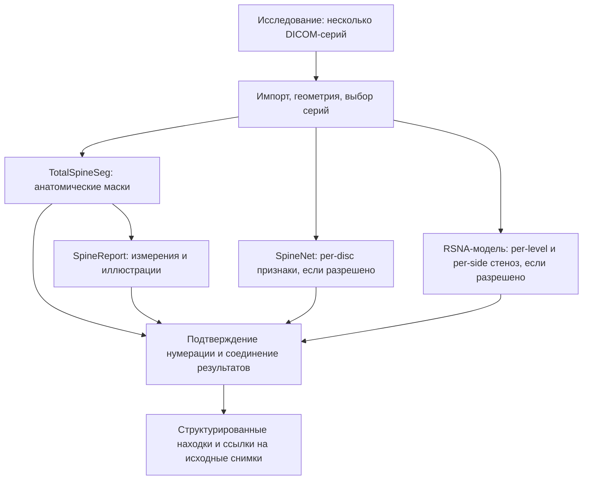

# Повторное использование готовых моделей для поясничного МРТ

> Исследовательский снимок на 8 октября 2026 года. Источник: `med diploma/docs/lumbar_mri_reuse_research_ru.md`.
> Это перенесённый контекст исходного проекта, а не действующая спецификация standalone-форка SpinoSarc.
> Упомянутые реализованные backend/API, модели-классификаторы, SPIDER ROI, локальные команды и результаты относятся к исходному проекту `med diploma` и сюда не перенесены.
> Названия «наш проект», «реализовано» и «следующий этап» ниже читаются в этом историческом контексте. Исследовательские предложения не означают подключённых или проверенных диагностических компонентов.
> Действующая [инструкция демо](../../demo/README.md); [индекс исследований и текущее состояние](../README.md). Источники и даты исходного исследования сохранены; новой проверки источников при переносе не проводилось.

Последующее дополнение: [GitHub-анализ «снимок → контур → размеры»](lumbar_mri_visual_findings_reuse_ru.md) добавляет готовый SCT/model-canal-seg для мешка, проверку SpinoSarc и конкретный стек выдачи изображений/измерений. Это кандидаты для воспроизведения, не уже подключённые модели.

Проверка источников: 7 октября 2026 года. Задача — backend-демо на открытых исследованиях, без новой врачебной разметки. Ниже отдельно отмечены опубликованные возможности и то, что действительно проверено запуском у нас. В рамках этого исследования новые модели и веса не устанавливались; ссылки на веса проверены по документации/исходникам, но сами checkpoint-файлы не скачаны и не исполнены.

Дополнительный поиск именно измерений выявил готовые компоненты, которых не было в первом shortlist: AP мешка с опубликованными весами и индекс высоты диска OLSIA. Файлы и ограничения проверены в [обзоре автоматических измерителей](lumbar_mri_measurement_tools_ru.md). Измерительную часть сначала развиваем через эти компоненты и SpineReport, а не пишем целиком с нуля.

## Решение для следующего этапа

**Сначала проверять готовые веса; собственное обучение запускать для конкретных незакрытых задач.** Уже сделанный импорт, геометрию, API, хранение артефактов и адаптер TotalSpineSeg сохранить. Они нужны независимо от диагностической модели.

Для широкого анализа отдельных дисков первый кандидат — SpineNet V2, если условия использования подходят нашему демо. Для подробных степеней стеноза — предобученные решения RSNA 2024. Для проверяемых измерений — SpineReport поверх TotalSpineSeg. Это разные источники результата; их оценки нельзя автоматически считать взаимозаменяемыми или усреднять.

## Кандидаты

| Проект | Что можно взять | Готовность весов по источнику | Решение |
|---|---|---|---|
| [SpineNet V2](https://github.com/rwindsor1/SpineNet) | Локализация/нумерация; оценки дегенеративных изменений каждого диска, включая бинарную грыжу | Официальный загрузчик и четыре URL checkpoint-файлов | Первый кандидат для широкого демо на sagittal T2; использование зависит от лицензии |
| [TotalSpineSeg](https://github.com/neuropoly/totalspineseg) | Маски позвонков, дисков, канала и спинного мозга | Официальные релизы; адаптер уже есть в нашем коде | Сохранить как анатомическую основу |
| [SpineReport](https://github.com/ivadomed/SpineReport) | Морфометрия, сигнальные признаки, изображения и отчёт | Использует результат TotalSpineSeg | Переиспользовать измерительный слой; не обещать автоматическое заполнение всей патологии |
| [RSNA 2024, третье место](https://github.com/Moyasii/Kaggle-2024-RSNA-Pub) | Локализация и классификация стенозов по уровню/стороне | Опубликован quick predict с загрузкой pretrained bundle из Kaggle | Основной кандидат RSNA для проверки воспроизводимости; тяжёлое GPU-окружение |
| [RSNA 2024, Heng, часть решения команды седьмого места](https://github.com/hengck23/solution-rsna-2024-lumbar-spine) | Отдельные модели foraminal narrowing и central canal stenosis | Ссылки на веса/логи в Google Drive и inference notebook | Резерв для более узкого эксперимента; брать только исправленные NFN-модели |
| [SPINEPS](https://github.com/Hendrik-code/spineps) | Более подробная сегментация анатомии, отдельная нумерация VERIDAH | Автозагрузка моделей на первом запуске | Резервный сегментатор; сейчас не добавлять второй анатомический конвейер без необходимости |

### SpineNet: он действительно ближе к нашей задаче, чем первоначально учитывалось

В актуальном [GradingModel](https://github.com/rwindsor1/SpineNet/blob/main/spinenet/models/grading.py) есть 11 выходных голов. Рабочая функция [classify_ivd_v2_resnet](https://github.com/rwindsor1/SpineNet/blob/main/spinenet/utils/classification.py), вызываемая `grade_ivds`, возвращает:

- Pfirrmann: 5 классов; narrowing дискового пространства: 4; центральный стеноз: 4; спондилолистез: 3.
- Дефекты верхней/нижней замыкательной пластинки и изменения костного мозга выше/ниже диска: бинарные оценки.
- Фораминальный стеноз слева/справа и грыжа: бинарные оценки.

Здесь изменения костного мозга не означают отдельное распознавание всех типов Modic, а `Herniation` не содержит размер, сторону, протрузию/экструзию или миграцию. Наличие голов подтверждено исходниками; загрузка опубликованного checkpoint и соответствие его параметров этой версии ещё не проверены.

Вход диагностической части — sagittal T2. [API](https://github.com/rwindsor1/SpineNet/blob/main/spinenet/main.py) строит собственные resampled IVD volumes из обнаруженных позвонков, поддерживает CPU и CUDA. Сначала воспроизвести весь upstream-путь; наши TSS crops нельзя подставить вместо его входа без проверки преобразований. Официальный [загрузчик](https://github.com/rwindsor1/SpineNet/blob/main/spinenet/__init__.py) содержит веса detection, appearance, context и grading на сервере Oxford VGG.

**Главное ограничение — условия использования.** [Лицензия SpineNet](https://github.com/rwindsor1/SpineNet/blob/main/LICENCE.md) распространяется на код, веса и результаты и разрешает строго некоммерческие исследования. README указывает возможность получить более разрешительную лицензию у авторов. Само слово «демо» не подтверждает соответствие этим условиям, особенно при намерении использовать результаты в коммерческом продукте. До интеграции зафиксировать подходящие права; не использовать его результаты для коммерческой псевдоразметки по умолчанию.

### RSNA: готовые степени стеноза с привязкой к уровню и стороне

Задачи [RSNA 2024](https://www.rsna.org/artificial-intelligence/ai-image-challenge/lumbar-spine-degenerative-classification-ai-challenge): центральный стеноз, левое/правое сужение отверстий и левый/правый субартикулярный стеноз на пяти поясничных уровнях. Это 25 оценок с категориями normal/mild, moderate, severe. Normal/mild — объединённый класс, его нельзя отображать просто как «норма». Конкурсная шкала не является готовой оценкой Schizas, компрессии конкретного корешка или морфологии грыжи.

У [третьего места](https://github.com/Moyasii/Kaggle-2024-RSNA-Pub) опубликованы код под MIT, quick predict и bundle [RSNA2024-LSDC-3rd-Models-Pub](https://www.kaggle.com/datasets/akinosora/rsna2024-lsdc-3rd-models-pub). [prepare_data.py](https://github.com/Moyasii/Kaggle-2024-RSNA-Pub/blob/main/src/utils/prepare_data.py) скачивает также конкурсные данные и дополнительный корпус координат; не запускать его как загрузчик одних весов. Авторы предупреждают, что некоторые модели требуют 48 GB VRAM. Полный ансамбль не считать готовым локальным запуском на MacBook Air. Для MVP исследовать отдельную пару «локализатор + classifier»; сокращение ансамбля меняет качество и требует своей проверки.

У [Heng](https://github.com/hengck23/solution-rsna-2024-lumbar-spine) MIT-код, ссылки на веса и notebook, но часть NFN-весов обучена с ошибкой перестановки левой/правой стороны. Авторы отдельно описывают исправленные folds 2 и 3. Эти варианты нельзя смешивать. Это часть решения команды седьмого места, а не полный универсальный диагностический пакет.

Для полного покрытия понадобятся sagittal T1, sagittal T2/STIR и axial T2; конкретные ветви имеют собственные требования. [Корпус RSNA](https://registry.opendata.aws/rsna-lumbar-spine-degenerative-classification-dataset/) содержит несколько серий на исследование и ограничен некоммерческим использованием, распространение копий данных запрещено. MIT кода не подтверждает автоматически права на скачиваемый checkpoint и целевое использование корпуса. Отдельную лицензию bundle Kaggle из доступной страницы подтвердить не удалось; коммерческую пригодность весов пока отмечать `unverified`, а не делать вывод по лицензии данных.

### SpineReport: готовый слой измерений поверх нашего сегментатора

[SpineReport](https://github.com/ivadomed/SpineReport) извлекает морфометрию канала, дисков, позвонков и отверстий, а также признаки CSF и формирует отчёты с распределением контрольной группы. CLI ожидает результаты TSS в 1 mm isotropic space (`--iso`). В нашем backend сейчас важна исходная физическая сетка: для интеграции нужны сохранённые преобразования и обратная привязка измерений/иллюстраций к исходному МРТ. Интерполяция не добавляет исходной детализации.

В [препринте авторов, июнь 2026](https://arxiv.org/abs/2606.10021) есть сравнение измерений со степенями стеноза. Для центрального стеноза результаты обнадёживают; для латерального кармана связи умеренные, для фораминального стеноза значимой связи в исследовании не нашли. Это аргумент переиспользовать измерения, но не превращать любой рассчитанный параметр отверстия в клиническую степень.

Код имеет [LGPL-3.0](https://github.com/ivadomed/SpineReport/blob/main/LICENSE). В первую очередь подключать измерительный модуль и его артефакты. Контрольную группу не объявлять нормативной базой без проверки состава. CSF-признак и маска spinal canal не заменяют отдельный контур дурального мешка.

### SPINEPS и остальные найденные варианты

[SPINEPS](https://github.com/Hendrik-code/spineps) предоставляет анатомические маски, подробные подструктуры позвонков и нумерацию, включая варианты T13/L6. Есть T1/T2-модели, CPU-режим и автозагрузка весов; код Apache-2.0. Отдельные условия конкретных весов ещё надо зафиксировать. Он может помочь при проблемах локализации, но не выдаёт вместо нас полный список патологий.

Дополнительные кандидаты, которые сейчас не ставим перед основным shortlist:

| Проект | Причина |
|---|---|
| [BianqueNet](https://github.com/no-saint-no-angel/BianqueNet), [зеркало модели](https://huggingface.co/alexbene/BianqueNet) | Сегментация IVD-областей на T2; карточка зеркала написана не авторами. Происхождение и условия конкретного checkpoint требуют проверки |
| [LSMA-PQR](https://github.com/farhatmasood/LSMA-PQR) | Полезный multi-view корпус и baseline-код для градаций/находок. В просмотренных материалах не подтверждён готовый загружаемый комплект диагностических весов; не считать plug-and-play |
| [NUHS/NUS SpineAI](https://github.com/NUHS-NUS-SpineAI/SpineAI-Detect-Classify-LumbarMRI-Stenosis) | Три задачи стеноза; [inference](https://github.com/NUHS-NUS-SpineAI/SpineAI-Detect-Classify-LumbarMRI-Stenosis/tree/master/Inference) описывает использование весов после обучения. Готовый опубликованный комплект не подтверждён; старое окружение TensorFlow 1.15/Python 3.6 |
| [SpineScan](https://github.com/denatns/SpineScan) | Готовая ссылка на модель Pfirrmann, но только часть наших задач, лицензия CC BY-NC 4.0 |
| [SpineFM](https://github.com/sjsimons/SpineFM) | Работает с рентгенограммами; для текущего МРТ-входа не подходит |

«Не подтверждён» означает результат данного обзора, а не доказательство отсутствия весов у авторов. Описанные в статьях дополнительные дообучения SpineNet для других болезней также не означают, что соответствующие веса включены в публичный bundle.

## Предлагаемая архитектура

SpineNet и RSNA — альтернативы или дополнения по конкретным задачам, а не обязательные зависимости каждого задания. TSS не обязан быть их локализатором. Сохранять собственный upstream preprocessing каждого провайдера и явное соответствие его уровней нашей анатомии. При расхождении нумерации не соединять результаты молча.

Это остаётся гибридной системой: готовые нейросети обнаруживают структуры/оценивают признаки; геометрия и сборка ответа считаются детерминированно. Входная ROI или heatmap помогает проверять привязку, но не делает нейросетевую классификацию прозрачным правилом.

## Что делаем практически

1. **Зафиксировать два независимых выбора:** широкие признаки диска (SpineNet, при подходящих правах) и измерения (SpineReport + TSS). Для стеноза держать RSNA третьего места как следующий технический кандидат. Не начинать обучение нового SPIDER-классификатора до результата этих проверок.
2. **Воспроизвести upstream inference вне API.** Сначала один открытый случай и фиксированные версии кода/весов, затем небольшой набор. Проверить checkpoint, требуемые входы, время/память, ошибки и реально возвращаемые поля. Для SpineNet начать с sagittal T2; для RSNA нужен открытый multi-series DICOM, текущие одиночные SPIDER T2 не покрывают все его задачи.
3. **Сделать адаптер провайдера.** Обработка исследования с несколькими сериями; статусы по задачам; уровень/сторона; исходная шкала; версия и хеш весов; координаты ROI/срезов и преобразования. Сохранять сырые выходы отдельно. Argmax-класс не выдавать за калиброванную вероятность: в SpineNet её придётся получать из logits отдельной адаптацией.
4. **Сравнить на опубликованных метках, где они совместимы.** Для первого показа новая врачебная разметка не обязательна. Отдельно показывать техническую воспроизводимость, покрытие и диагностические метрики. Совпадение train-наборов готовых весов с проверяемым корпусом фиксировать; такой прогон не объявлять независимой валидацией.
5. **Выбрать модель по результату, затем расширять.** Первое демо может содержать реально поддержанные per-disc признаки и/или степени стеноза; bulging не обязателен, если готовый провайдер его не оценивает. Неподдержанные поля остаются `not_assessed`. Свой training — для измеримого пробела после проверки готовых альтернатив.

Результат первого эксперимента: manifest модели и входов, сырые предсказания, таблица находок по уровням, привязка к изображениям, время/память, список неподдержанных полей и ошибок. Это конкретный критерий выбора вместо обещания «потом обучим всё».

## Что готовыми компонентами пока не закрыто

В рассмотренных готовых комплектах не подтверждено полное автоматическое описание формы/размеров/миграции/секвестрации грыжи, воздействия на конкретный корешок и патологического сигнала конуса. Градация стеноза не устанавливает корешковую компрессию; бинарная грыжа не даёт её морфологию. Эти поля потребуют отдельной модели с подходящими метками или ручного заполнения.

Для будущего допуска сохранять происхождение данных/весов, версии, воспроизводимые преобразования, явные состояния отказа и проверяемые изображения с самого MVP. Повторное использование модели сокращает разработку, но не переносит на наш продукт клиническую валидацию или статус регистрации чужого проекта.
