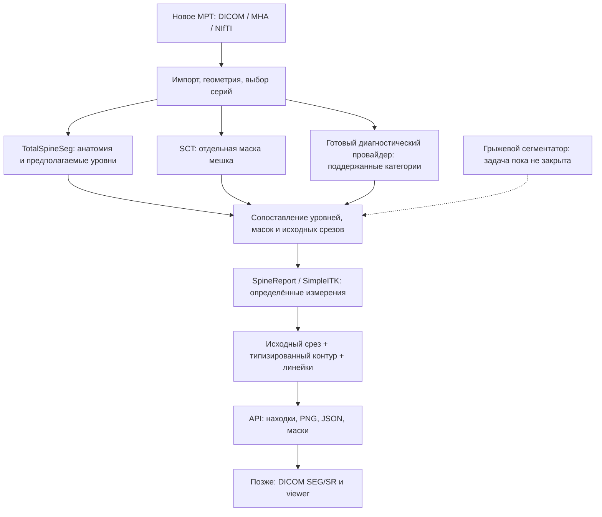

# Повторное использование инструментов: снимок → контур → измерение

> Исследовательский снимок на 8 октября 2026 года. Источник: `med diploma/docs/lumbar_mri_visual_findings_reuse_ru.md`.
> Это перенесённый контекст исходного проекта, а не действующая спецификация standalone-форка SpinoSarc.
> Упомянутые реализованные backend/API, модели-классификаторы, SPIDER ROI, локальные команды и результаты относятся к исходному проекту `med diploma` и сюда не перенесены.
> Названия «наш проект», «реализовано» и «следующий этап» ниже читаются в этом историческом контексте. Исследовательские предложения не означают подключённых или проверенных диагностических компонентов.
> Действующая [инструкция демо](../../demo/README.md); [индекс исследований и текущее состояние](../README.md). Источники и даты исходного исследования сохранены; новой проверки источников при переносе не проводилось.

Сводное решение по типам компонентов и очередям интеграции — в [карте компонентов](../architecture/lumbar_mri_component_map_ru.md).

Проверка: 7 октября 2026 года. Цель — бэкенд, который получает новое поясничное МРТ и возвращает находки по уровням, исходные срезы, подписанные контуры и размеры в физических единицах. Демонстрация использует открытые снимки, без новой врачебной разметки. Просмотрщик можно подключить позже.

**Рекомендация: сохранить TotalSpineSeg для анатомии, проверить SCT/model-canal-seg для отдельного мешка, переиспользовать SpineReport и SimpleITK для измерений, подключить подходящий готовый классификатор для патологических категорий.** Для настоящего контура поясничной грыжи и её клинических размеров готовый воспроизводимый публичный комплект в проверенных источниках не подтверждён. Этот пробел нельзя закрыть рамкой вокруг диска.

Это дополнительный GitHub-анализ к [обзору моделей](lumbar_mri_reuse_research_ru.md) и [поиску измерителей, включая GitLab](lumbar_mri_measurement_tools_ru.md). Проверены исходники inference/измерений, перечни файлов, метаданные релизов и первичные публикации. Новые зависимости не устанавливались, веса не скачивались, модели в нашем окружении не запускались. «Опубликовано» и «Воспроизведено у нас» — разные состояния.

## 1. Какой результат считаем выполнением задачи

| Находка | Требуемый контур | Подходящее измерение | Недостаточная замена |
|---|---|---|---|
| Центральное сужение | Дуральный мешок на указанном сечении; канал можно показать отдельно | AP по заданной линии, площадь конкретного сечения | Размер crop, неопределённая маска «канала», порог без метода |
| Дисковая дегенерация / снижение высоты | Поражённый диск и измерительные ориентиры | Определённая толщина в мм или отдельно названный DHI | Переименование медианной толщины в три радиологические высоты |
| Грыжа | Выпячивающийся дисковый материал, основная часть диска отдельно | Распространение относительно заданной границы, поперечный/краниокаудальный размеры, миграция | Целый диск, bbox локализатора, Grad-CAM |
| Фораминальный / субартикулярный стеноз | Соответствующая область и доступные структуры с указанием стороны | Поддержанная степень; геометрия отдельным методом | Площадь центрального мешка вместо оценки всех видов стеноза |

Классификация отвечает на вопрос о признаке. Сегментация определяет границу структуры. Линейка измеряет выбранные ориентиры. Для полноценной карточки нужны согласованные результаты этих задач.

## 2. Основной shortlist

| Инструмент | Что переиспользуем | Контур и размеры | Решение для бэкенда |
|---|---|---|---|
| [TotalSpineSeg](https://github.com/neuropoly/totalspineseg) | Предобученную nnU-Net, позвонки/диски/канал, предполагаемые уровни | Анатомические маски; не отдельная грыжа | Сохранить реализованный адаптер; исполнение и качество проверяются отдельно |
| [SCT + model-canal-seg](https://github.com/ivadomed/model-canal-seg) | Целевой контур мешка по определению авторов; качество на поясничных патологиях не проверено | Бинарная 3D-маска и QC; AP/площадь добавляет измерительный слой | Новый приоритет для PoC мешка, веса опубликованы |
| [SpineReport](https://github.com/ivadomed/SpineReport) | Морфометрию поверх TSS, CSV и иллюстрации | Канал, диски, отверстия; определения требуют согласования | Подключать выбранные функции через адаптер |
| [RSNA 2024, третье место](https://github.com/Moyasii/Kaggle-2024-RSNA-Pub) | Поуровневые/двусторонние категории трёх видов стеноза | Локализация и классификация; не граница поражённой ткани | Проверить минимальную исполнимую ветвь и права весов |
| [SpineNet V2](https://github.com/rwindsor1/SpineNet) | Поуровневую грыжу, дисковые признаки и стеноз | Область диска и категории; не размеры/маска грыжи | Условный вариант: некоммерческая лицензия, закрытое обучение |
| [SpinoSarc](https://github.com/neuromath/SpinoSarc) | Пример готового DICOM-приложения, сопоставления уровней и отчётов | CSA по выходу TSS; целевую структуру надо проверить | Пример интеграции, не готовое ядро диагностики грыжи |

### SCT: новый компонент для мешка

[Документация `canal`](https://spinalcordtoolbox.com/latest/user_section/command-line/deepseg/canal.html) описывает бинарную 3D nnU-Net v2; целевую структуру авторы называют дуральным мешком. Есть QC-наложения в аксиальной/сагиттальной плоскости. Это более прямой кандидат для нужного контура, чем переименование нашей TSS-маски канала.

Опубликован [pre-release r20260406](https://github.com/ivadomed/model-canal-seg/releases/tag/r20260406), архив весов 1 052 324 884 байт, примерно 1 GiB. Его URL зарегистрирован в [реестре моделей SCT](https://github.com/spinalcordtoolbox/spinalcordtoolbox/blob/master/spinalcordtoolbox/deepseg/models.py). В [inference](https://github.com/spinalcordtoolbox/spinalcordtoolbox/blob/master/spinalcordtoolbox/deepseg/inference.py) есть CPU/CUDA и восстановление ориентации/геометрии. Это подтверждение доступности реализации, не точности на поясничных патологиях.

Пример из текущей документации:

```sh
sct_deepseg canal -i volume.nii.gz -o output.nii.gz -qc qc/
```

Документация сейчас имеет версию `7.4.dev0`: команду нельзя обещать для любой старой стабильной установки. Фиксировать совместимый SCT commit/version и checkpoint. [Mac-инструкция](https://spinalcordtoolbox.com/latest/user_section/installation/mac.html) описывает Apple Silicon через Rosetta 2 / Docker; запуск на нашем Mac не проверен.

Роль: TSS даёт уровни, SCT — отдельную маску мешка, измерительный слой — контур/линию/площадь. Модель сама не выдаёт степени стеноза, номера дисков или контур грыжи. При недостаточной исходной детализации площадь остаётся неоценённой; ресэмплинг в 1 мм не превращает толстосрезовую сагиттальную серию в качественную аксиальную.

Код репозитория [MIT](https://github.com/ivadomed/model-canal-seg/blob/main/LICENSE); отдельные условия содержимого весов пока не подтверждены. Обучающий pipeline предполагает авторизованный SSH-доступ к данным. Происхождение «все обучающие изображения открыты» не подтверждено.

### SpineReport: готовый вычислительный слой

В [measure_seg.py](https://github.com/ivadomed/SpineReport/blob/main/spinereport/utils/measure_seg.py) есть площадь и AP/RL размеры сечений канала, медианная толщина/объём диска, показатели отверстий, CSV и PNG-наложения. `median_thickness` остаётся авторским показателем, а не передней/средней/задней высотой.

[Входной pipeline](https://github.com/ivadomed/SpineReport/blob/main/README.md) ожидает TSS в изотропной геометрии: хранить преобразования к исходным снимкам. Канал в измерительном коде составляется из SC+CSF-меток; отдельная SCT-маска не становится совместимой автоматически — нужен адаптер с проверенным определением показателя. Контрольная группа отчёта не является автоматически клинической нормой. Код [LGPL-3.0](https://github.com/ivadomed/SpineReport/blob/main/LICENSE).

### Диагностические модели: категория отдельно от контура

[RSNA-модель третьего места](https://github.com/Moyasii/Kaggle-2024-RSNA-Pub) и [bundle весов](https://www.kaggle.com/datasets/akinosora/rsna2024-lsdc-3rd-models-pub) — кандидат для 25 оценок: пять уровней × центральный, два фораминальных и два субартикулярных стеноза. Полное решение использует sagittal T1, sagittal T2/STIR и axial T2. Некоторые модели требуют 48 GB VRAM; полный ансамбль для Mac не обещаем. Уменьшенная ветвь требует своей проверки качества. `normal/mild`, `moderate`, `severe` не заменять шкалой Schizas или утверждением о конкретном корешке. Код MIT; права checkpoint отдельно не подтверждены. [Условия данных RSNA](https://registry.opendata.aws/rsna-lumbar-spine-degenerative-classification-dataset/) ограничивают использование корпуса.

У SpineNet [11 голов](https://github.com/rwindsor1/SpineNet/blob/main/spinenet/models/grading.py), включая бинарную грыжу, центральный стеноз, двусторонний фораминальный признак и дисковую дегенерацию. [Классификация](https://github.com/rwindsor1/SpineNet/blob/main/spinenet/utils/classification.py) не возвращает маску выпячивания/миграцию/три размера. Сначала воспроизвести собственную локализацию и подготовку IVD upstream; произвольный TSS crop не эквивалентен входу модели. [Лицензия](https://github.com/rwindsor1/SpineNet/blob/main/LICENCE.md) ограничивает код, веса и результаты некоммерческими исследованиями. Это условный кандидат, не безусловная основа продукта.

### SpinoSarc: пример приложения с важным ограничением

В [репозитории](https://github.com/neuromath/SpinoSarc) есть DICOM-просмотр, TSS, сопоставление уровней, анализ мышц и отчёты; код [MIT](https://github.com/neuromath/SpinoSarc/blob/main/LICENSE).

Проверка реального пути [MultiLevelAnalyzer](https://github.com/neuromath/SpinoSarc/blob/main/spinosarc_app/totalspineseg/multi_level_analyzer.py) уточняет геометрию: он вызывает `resample_canal_to_axial_slice` с координатами исходного аксиального среза, затем считает площадь маски и применяет пороги. Функция `compute_canal_csa` с world-z/индексом оси не является этим главным путём; её ограничения нельзя переносить на весь pipeline. При этом источник контура остаётся `step1_canal` TSS. Название «dural sac CSA» не подтверждает независимую сегментацию мешка: целевую структуру и качество требуется проверить. Грыжевой детектор и контур выпячивания этим не закрыты.

Практическая готовность: [релиз v0.2.0](https://github.com/neuromath/SpinoSarc/releases/tag/v0.2.0) содержит автоматические контуры/анализ, но по GitHub API не имеет загруженного DMG. У [v0.1.1](https://github.com/neuromath/SpinoSarc/releases/tag/v0.1.1) опубликован установщик `SpinoSarc-0.1.0.dmg`; в описании этой версии контур мешка задаётся вручную. Поэтому скачать существующий DMG и получить весь функционал текущего source нельзя обещать.

## 3. Дополнительные измерители

| Инструмент | Подтверждённый результат | Решение |
|---|---|---|
| [Nixon AP tool](https://huggingface.co/akashnixon123/apdiameter007) | YOLO-OBB + Attention U-Net веса; AP в CSV и линия на JPEG выбранного midsagittal T2 DICOM | Резерв для 2D AP. Исправить PixelSpacing/длину/нумерацию; лицензия не подтверждена; нет 3D CSA |
| [OLSIA / SpineSlicer](https://github.com/imedslab/spineslicer), [веса](https://github.com/imedslab/lsmodels) | Сегментация, DHI и четыре класса Pfirrmann 2–5 в опубликованном пути | Дополнительный показатель. DHI безразмерный, Slicer-зависимости нужно отделять; лицензия не подтверждена |
| [Sudirman / Natalia](https://data.mendeley.com/datasets/zwd3hgr6gg/1) | MATLAB-геометрия ориентиров на многоклассовых сегментациях | Алгоритмический резерв; полная готовая сегментационная цепочка с весами не подтверждена |

Аудит архивов, ошибки, окружения и происхождение данных — в [отдельном документе](lumbar_mri_measurement_tools_ru.md). С появлением SCT сначала проверять 3D-маску мешка и существующие измерительные функции; Nixon не является обязательным следующим download.

## 4. Поиск контура самой грыжи

| Проект | Что обнаружено | Почему не считать готовым lumbar-измерителем |
|---|---|---|
| [LDH-DL-MODEL](https://github.com/ElzatElham/LDH-DL-MODEL) | Training/testing wrappers и YAML; pretrained-ссылки на базовые YOLO | Не подтверждены обученные lumbar checkpoints и измерительный inference |
| [mutil-task](https://github.com/ViolentLittleHead/mutil-task), [predict](https://github.com/ViolentLittleHead/mutil-task/blob/main/End2End_predict.py) | Сегментация дисков + LDH-классификация; отсутствующий checkpoint/import | Воспроизводимый комплект не подтверждён; маска диска не равна грыже |
| [CervAI-X](https://github.com/zhibaishouheilab/CervAI-X) | Выделение заднего выпячивания на сегментациях | Шейный отдел, фиксированные уровни/пороговые допущения и ограничения использования |
| [MRI-GPT](https://github.com/NeoNogin/MRI-GPT) | TSS, выбор среза и vision LLM для severity JSON | Не подтверждён патологический контур с калиброванными размерами |
| [MRI-pathology](https://github.com/Trmy210/MRI-pathology) | Поуровневая классификация и Grad-CAM | Карта внимания не является границей для линейки |
| [U-ResNet, 2026](https://www.nature.com/articles/s41598-026-42870-9) | Работа про protruded tissue | Код/данные по запросу; публичные готовые патологические веса не подтверждены |

Отдельный [поиск GitLab](lumbar_mri_measurement_tools_ru.md) нашёл анатомический SpineSegDiff и неопределённость SpineNet, но не закрыл патологическую маску выпячивания. Вывод относится к проверенным публичным релизам; он не доказывает отсутствия любого решения в интернете или у авторов.

Последующий метод — сегментация выпячивающегося материала или модель клинических ориентиров относительно задней границы дискового пространства. Для эвристики на TSS сначала проверить, что целевые маски действительно включают патологический материал. Результат эвристики — кандидат, который не получает автоматически статус измеренной грыжи. Границу диска, направление AP и миграцию определять явно, с учётом позы/уровня. Это отдельная задача после воспроизведения готовых компонентов.

## 5. Библиотеки измерений и вывода

| Компонент | Роль | Когда подключать |
|---|---|---|
| [SimpleITK](https://github.com/SimpleITK/SimpleITK), Apache-2.0 | Физическая геометрия, контуры/overlay, площади/объёмы и форма масок | Уже есть в backend; использовать для PNG и измерений |
| [highdicom](https://github.com/ImagingDataCommons/highdicom), MIT | DICOM SEG для масок, SR для измерений и ссылок на снимки | После работающего PNG/JSON, для обмена с viewer |
| [3D Slicer](https://github.com/Slicer/Slicer) | Просмотр/исправление масок, линейки, SegmentStatistics | Для проверки и дальнейшего review; не обычный импорт `slicer` в FastAPI |
| [Cornerstone3D](https://github.com/cornerstonejs/cornerstone3D) / [OHIF](https://github.com/OHIF/Viewers), MIT | Веб-просмотр масок и пространственных измерений | Следующий этап интерфейса |
| [MONAI Label](https://github.com/Project-MONAI/MONAILabel), Apache-2.0 | Сервер исправления/сбора разметки через Slicer/OHIF | При появлении ресурса на аннотацию; готовую lumbar-hernia модель не заменяет |

SimpleITK предоставляет [LabelShapeStatistics](https://simpleitk.org/doxygen/latest/html/classitk_1_1simple_1_1LabelShapeStatisticsImageFilter.html), [LabelContour](https://simpleitk.org/doxygen/latest/html/classitk_1_1simple_1_1LabelContourImageFilter.html) и [LabelOverlay](https://simpleitk.org/doxygen/latest/html/classitk_1_1simple_1_1LabelOverlayImageFilter.html). Feret/OBB — показатели формы; без клинического определения они не становятся размерами грыжи. Измеритель не исправляет неверную маску.

[highdicom quickstart](https://highdicom.readthedocs.io/en/stable/quickstart.html) включает SEG и SR MeasurementReport с пространственными ROI. Для MHA/NIfTI без исходных DICOM достаточно маски + JSON + PNG; нельзя выдумывать связь с отсутствующим SOP. Viewer сам заболевание не распознаёт.

## 6. Предлагаемый конвейер



Это предложение, не схема установленного диагностического решения. Наш собственный код — адаптеры запуска, согласование серии/уровня/стороны, преобразования, выбор срезов, контракт находки и выдача артефактов. Детектор, сегментатор и базовую геометрию переиспользуем при наличии подходящего компонента.

Разные серии не совмещать по номеру среза. Проверить геометрию/FrameOfReference и движение пациента; при несовместимости нужна регистрация либо независимый анализ. Контур с толстосрезовой сагиттальной серии, перенесённый на axial T2, не становится независимой качественной аксиальной сегментацией.

### Контракт находки

- Тип проблемы, предполагаемый уровень, сторона, исходная шкала, статус оценки и отдельный статус нумерации.
- Версия детектора/весов; score без обещания калиброванной клинической вероятности.
- Исходная серия/срез либо определение плоскости, физические координаты и преобразования.
- Тип контура: `affected_disc`, `canal`, `dural_sac`, `herniated_material`; отдельно `analysis_roi` и `attention_map`.
- Измерение с названием метода, единицей, линией/конечными точками или площадным контуром, разрешением исходных данных.
- Ссылки на исходное изображение, PNG с аннотациями, маску и JSON доказательств.
- Причина `not_assessed`, если структура не видна, метод неприменим или провайдер отсутствует.

Первый результат для сужения: **карточка предполагаемого L4–L5, исходный axial/sagittal срез, контур мешка, AP-линия и/или площадь сечения, отдельно предсказанная категория стеноза**. Для грыжи до появления патологической маски — категория и контур поражённого диска; размеры выпячивания остаются `not_assessed`.

## 7. Что использовать из нашего кода

| Уже есть | Что добавить |
|---|---|
| `imaging.py`: импорт, геометрия и ссылки на DICOM | Требования серий провайдеров, согласование нескольких серий |
| `segmentation.py`: изолированный TSS subprocess, маски и происхождение | SCT-provider без тяжёлых импортов в FastAPI |
| `levels.py`: ROI и условные измерения канала | Контуры, определения измерений мешка, проверенное переформатирование |
| `lumbar.py`: диагностические поля `not_assessed` | Результаты подключённого провайдера и evidence |
| `main.py`: артефакты анализа | Разные MIME/расширения: текущая выдача ориентирована на MHA |
| `render_lumbar_overlay.py`: анатомические sagittal overlays | API-артефакт с нужным контуром, линейкой и значением |

Существующие AP-концы в LPS полезны, но текущие маски канала не объявляются мешком. Реализованный pipeline всё ещё `lumbar_levels`; новые диагностические модели не подключены.

## 8. Порядок PoC

1. **Воспроизвести TSS на открытом МРТ и подключить реальный render к API.** Проверить совпадение контуров со снимками и исходную геометрию. Это анатомическая карточка.
2. **Проверить SCT на небольшой технической подборке открытых исследований** с поясничным мешком, достаточным coverage и случаями сужения. Зафиксировать версию, веса, память/время и условия использования. Если маска подходит, добавить `dural_sac` и измерения. Новая разметка пациентов для такого PoC не требуется; клиническая точность без эталона не заявляется.
3. **Подключить функции SpineReport**, сверить определение/плоскость показателей. Площадь выбирать внутри заданной области уровня после контроля маски; ошибочный одиночный минимум не становится «самым тяжёлым сужением».
4. **Воспроизвести минимальный RSNA-провайдер** в доступном окружении на исследованиях с нужными сериями. При неподходящих правах/ресурсах сохранить геометрический PoC без автоматической степени. SpineNet — вариант при подходящих условиях.
5. **Отдельно закрыть контур грыжи:** получить патологический checkpoint либо доступ у авторов; при установленном пробеле — собственный узкий метод. Ручной контур допустим как явно ручной режим, не автоматическое обнаружение.

Техническое принятие: LPS-расстояние совпадает с выдаваемыми мм; площадь относится к указанной плоскости/контуру; перенос маски сохраняет сторону; flips/rotations/анизотропия не меняют физический результат; отсутствующий spacing/coverage приводит к неоценённому измерению; сбой модели не оставляет ложную «норму». Это не заменяет сравнение с радиологом.

## 9. Ограничение «на открытых данных»

Демо на открытых входных снимках и использование готовых весов — достижимый первый этап. «Весь pipeline обучен исключительно на открытых изображениях» требует проверки каждого pretrained компонента. У SpineNet, Nixon и OLSIA обучение не целиком открыто; у SCT такое происхождение не подтверждено. Публичность checkpoint не делает его обучающие данные открытыми.

Отдельно фиксировать лицензию кода, условия весов, доступность/условия обучающих данных и допустимость предполагаемого применения. MIT библиотеки не распространяется автоматически на подключённые модели. При строгом требовании открытого происхождения текущий shortlist не объявляется соответствующим до завершения проверки.

**Результат анализа:** анатомию, контуры мешка, морфометрию и вывод можно существенно переиспользовать. Первый PoC — визуальная оценка сужения с измерением конкретной структуры. Обведение и подробные размеры самой поясничной грыжи остаются отдельным пробелом.
